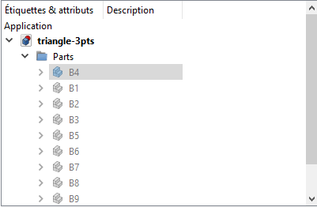
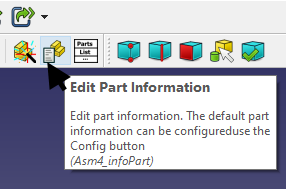
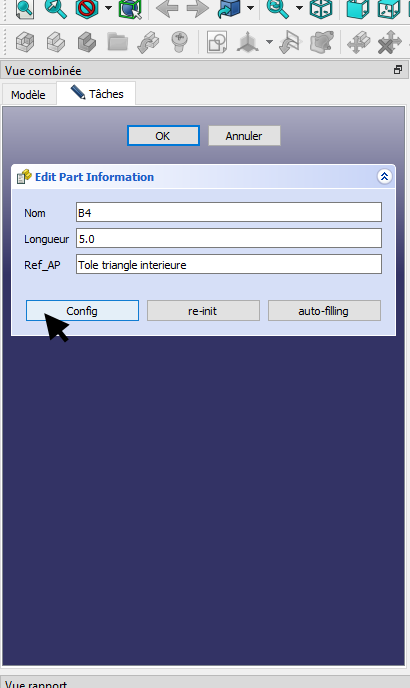
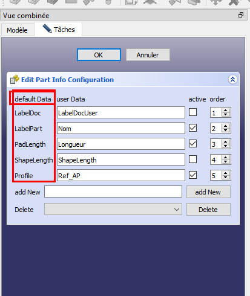
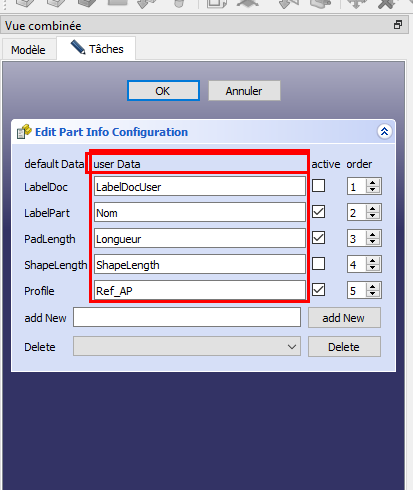
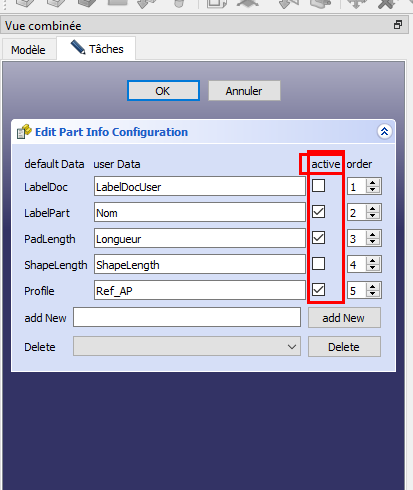
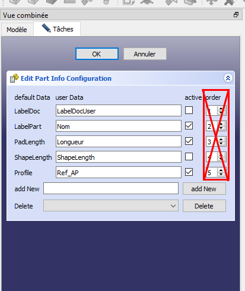
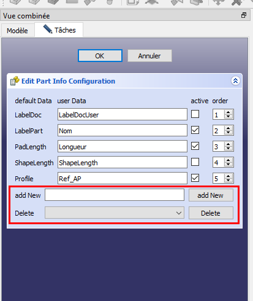
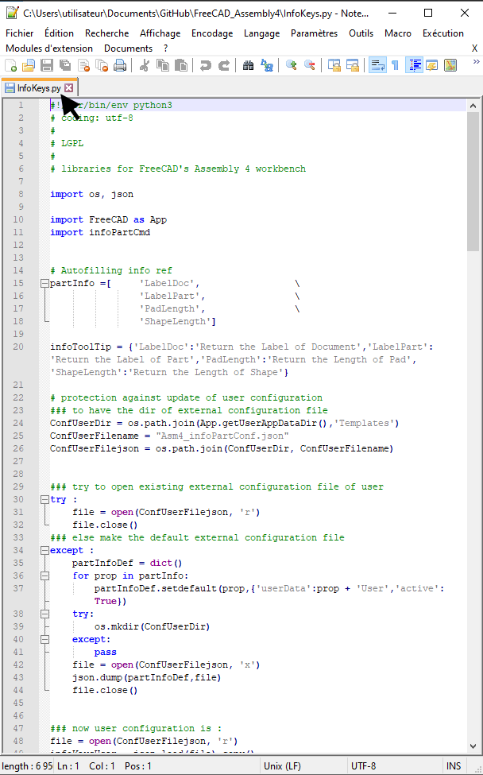
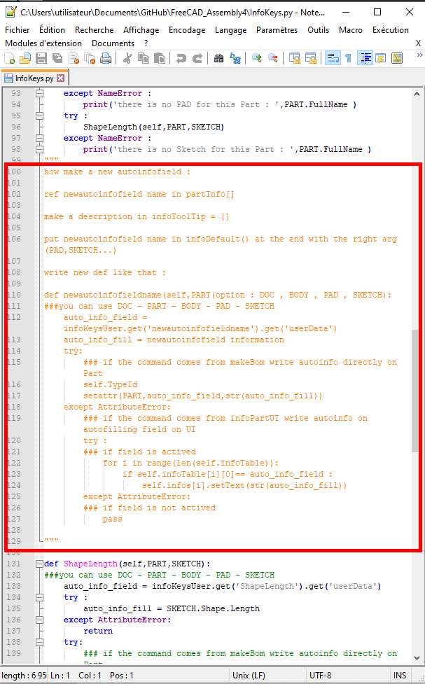

In the new version the BOM fields are configurable. 

explanation :

Select a part

Click on Edit Part Information

Click on config

in this column you will find the default names. 
If you stay with the mouse on a field a tooltip opens to indicate the principle of this autofield.

here you can customize the name of the field

here you can decide if you want to use this autofield

this function is currently not present

you can add fields to be filled in manually in Edit Part Information

Your request does not have the area to be managed by the current autofield so I will integrate your macro and a new autofiled will be present in the next version of ASM4.
Here is the file I will modify.

here there is a typical explanation for creating your own autofield

Have nice work ! 
