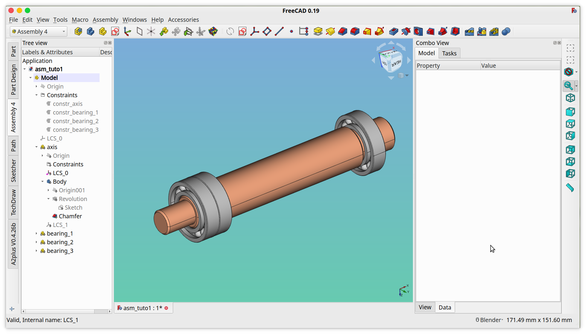

# FreeCAD Assembly 4 Tutorial 1

This tutorial has moved to [a new repository](https://github.com/Zolko-123/FreeCAD_Examples/blob/master/Asm4_Tutorial1/README.md)

## A quick start guide

This tutorial will walk you through building the following assembly:

* The axis is designed in FreeCAD with the PartDesign workbench
* The bearings are imported from a STEP file

## Feedback
Did this tutorial help you, do you have anything to share? Please open a ticket or mention something in the [dedicated FreeCAD forum thread](https://forum.freecadweb.org/viewtopic.php?f=20&t=34806) pertaining to this tutorial. You can also make a PR with your proposed changes.

Happy Assembling!
