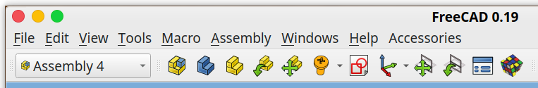
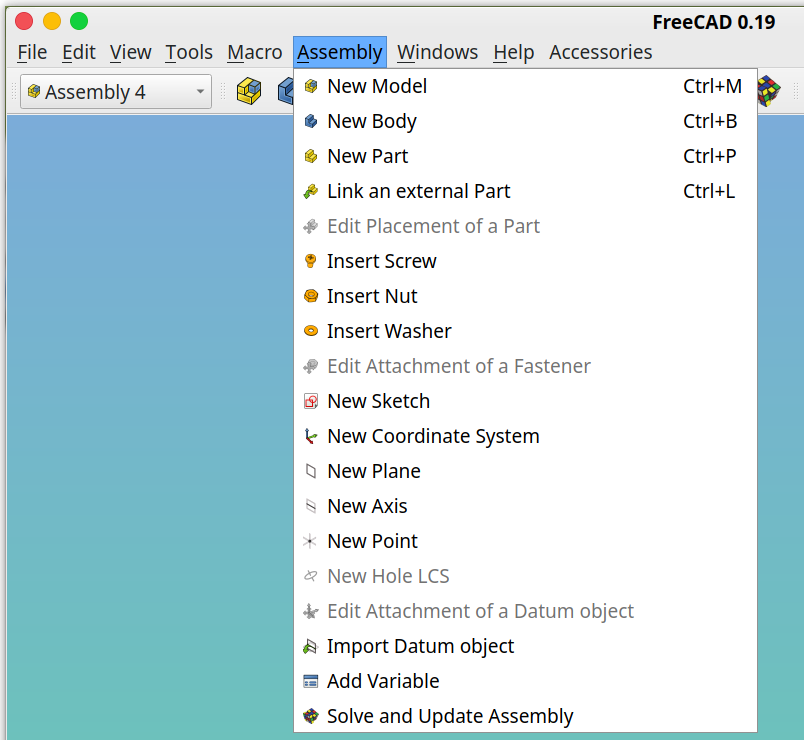
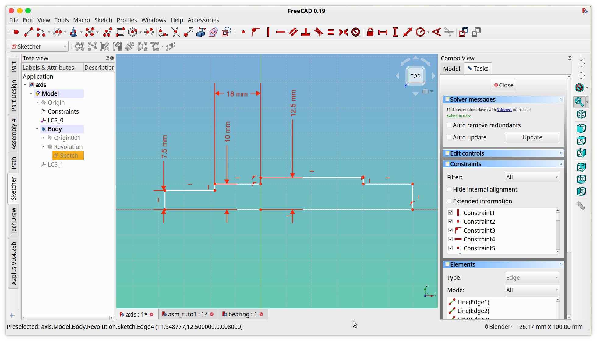
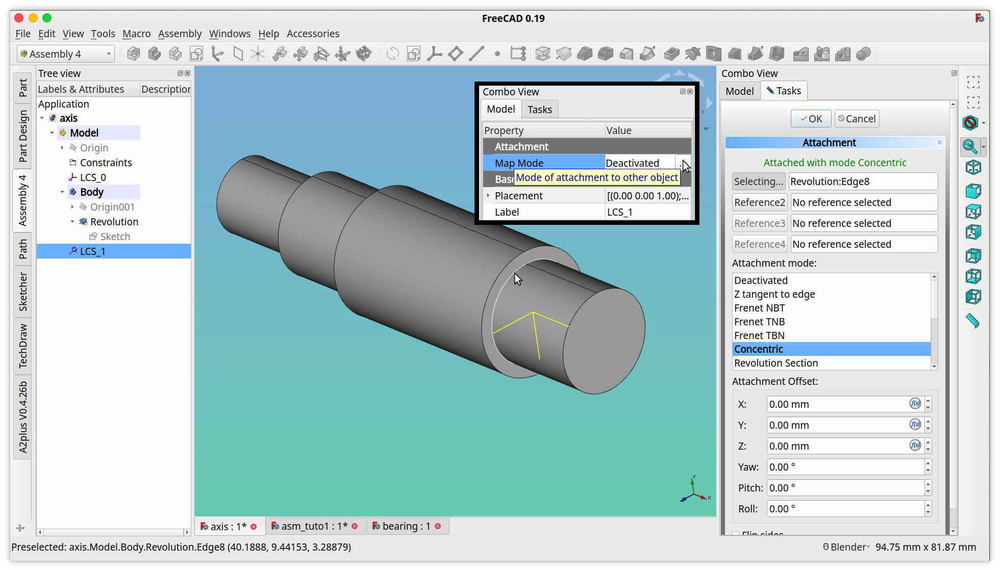
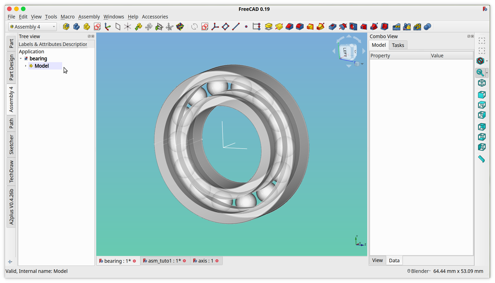
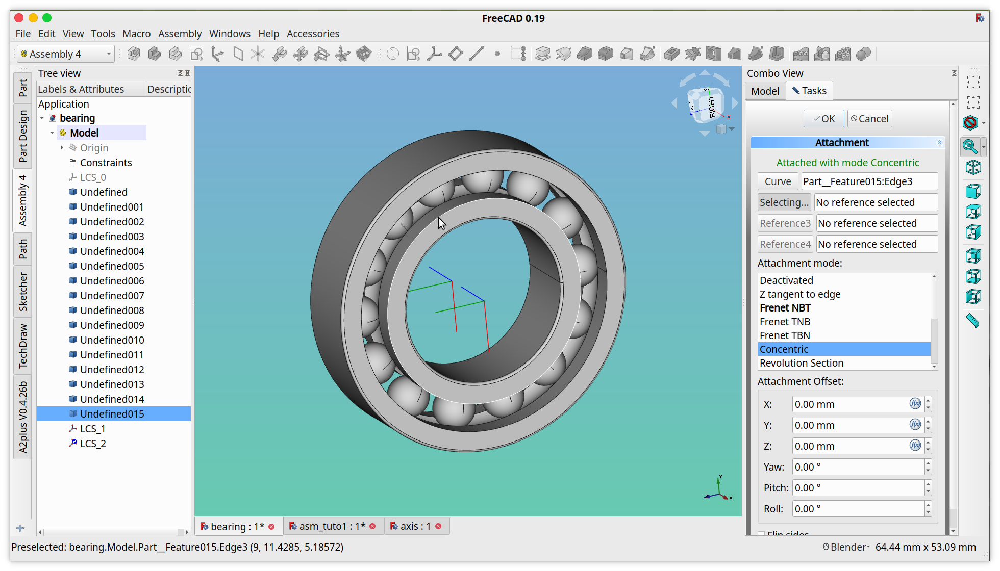
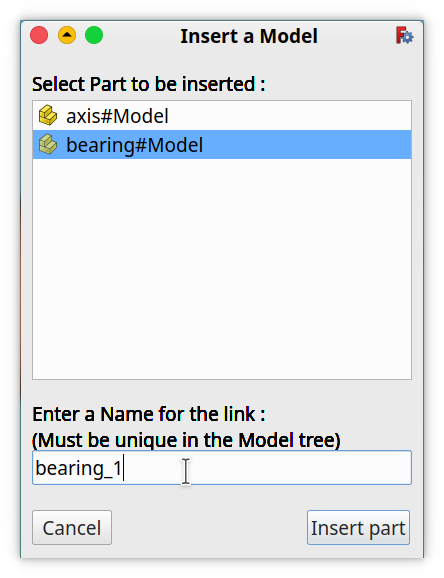
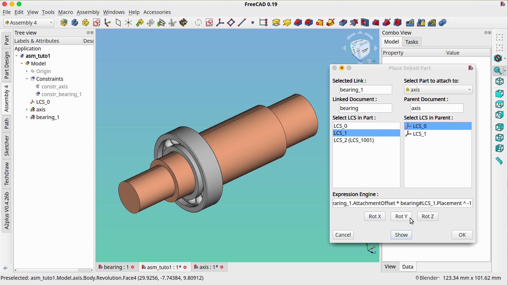
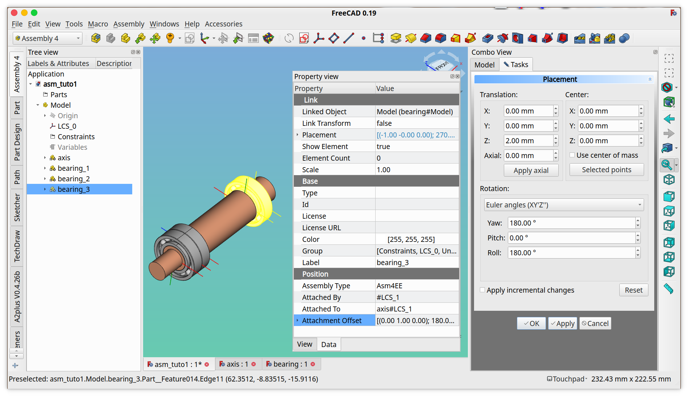

# FreeCAD Assembly 4 Tutorial 1

## A quick start guide

This tutorial will walk you through building the following assembly:

* The axis is designed in FreeCAD with the PartDesign workbench
* The bearings are imported from a STEP file

### Prerequisites

It is assumed you have read the [Assembly4 instructions](../../INSTRUCTIONS.md), and the Assembly4 workbench is already installed. It is also assumed you have basic knowledge of FreeCAD, especially the _PartDesign_ workbench.

Download the STEP file [`bearing_20x37x9.stp`](bearing_20x37x9.stp) (direct link to [`bearing_20x37x9.stp`](https://github.com/Zolko-123/FreeCAD_Assembly4/raw/master/Examples/Tutorial1/bearing_20x37x9.stp), right-click and save the file) to your local hard drive.

## Toolbar and Menu

Buttons in the toolbar are activated with relevant selection. If a button you want to use is inactive, try to change the selection (with the mouse).

These functions are also accessible with the Assembly menu:

## Create the documents

We start with an empty FreeCAD.

* Create 3 new documents: **File > New** (or _ctrl-n_)
* In each document, create a new Model: **Assembly > New Model** (or _ctrl+m_)
* Save each document in the same directory and name them:
  * _asm_tuto1.fcstd_
  * _axis.fcstd_
  * _bearing.fcstd_
* Close all 3 documents (you don't need to close FreeCAD)
* Re-open all 3 documents

**Result:** These documents are now ready to be used by Assembly4.

## Document "axis"

Switch to document "_axis_" (by clicking on its tab).

### Body

* Create a new Body: **Assembly > New Body** (or _ctrl+b_)
* Make body active (right-click on Body then choose **Toggle active body** from the context menu).
  **Result:** This will switch to the _PartDesign_ workbench.
* Create a new Sketch (should be in the active body). In the Task view, select _XY_Plane_
* Draw the following sketch:

  

* Make a revolution of the Sketch:

  

### LCS_1

* Switch to _Assembly4_ workbench
* Select the root Model (remember it's an `App::Prt`)
* Create a new Local Coordinate System (LCS) (**Assembly > New Coordinate System**). This can also be done by right-clicking on the Model in the tree, then choosing **Create > New Coordinate System** from the context menu
* Edit its MapMode in the Placement in its Property View (see inlay in screenshot below on how to activate it)
* Choose the circle as shown:

  

* Select the option **Concentric**
* Click **OK**

* **Note:** ignore the warning:

  `PartDesign::CoordinateSystem / LCS_1: Links go out of the allowed scope`

* In order to make our life easier later, we'll change the basic color of the Body by right-clicking on the Body in the Model tree, and choose _Appearance_ . In the _Display Properties_ dialog change the _Shape color_ to something fancy.

* Save

**Result:** The part _axis_ is now ready for assembly

## Document "bearing"

Switch to document "_bearing_" (by clicking on its tab).

If you haven't done so already, download the STEP file [`bearing_20x37x9.stp`](https://github.com/Zolko-123/FreeCAD_Assembly4/raw/master/Resources/parts/bearing_20x37x9.stp) to the same local directory as the 3 previous documents: _axis.fcstd_, _bearing.fcstd_, and _asm_tuto1.fcstd_.

### STEP import

* Import (**File > Import**) the previously mentioned STEP file _bearing_20x37x9.stp_

**Result:** This will create a bunch of solids in the bearing document, but not in the Model. This is a [documented limitation of `App::Part`](https://www.freecadweb.org/wiki/Std_Part) and must be dealt-with manually.

  

* Select within the Model tree, all the imported solids and drag them over the Model (in the tree). **Note** how the cursor changes to a small hand and an arrow appears close to the cursor, meaning that the solids are moved:

  

* You can check that the solids have indeed been moved by collapsing the Model tree (with the small triangle) and hovering over the Model in the tree with the mouse.
  **Note:** If it didn't work, fix it. If necessary, delete the file _bearing.fcstd_ and begin again.

  

### LCS

* In order to place this bearing in the assembly, we will need 2 new Local Coordinate Systems; each in the center, but each on 1 side. _LCS_0_ **looks** like it is in the center, **but one can never trust a STEP import** so we don't use that.  Instead, we create the 2 new Local Coordinate Systems and place them in the center of the geometry.
  * Select the Model in the tree view
  * Create a new Local Coordinate System (LCS) (**Assembly > New Coordinate System**), leave the default name LCS_1, click OK.
  * Create a new Local Coordinate System (LCS) (**Assembly > New Coordinate System**), leave the default name LCS_2, click OK.

#### Placing Local Coordinate Systems
* Now place LCS_1 by:
  * Right click _LCS_1_ in the tree
  * Choose _Edit datum_
  * Select the edge as shown in the screenshot below
  * Choose the **Concentric** option:

  

* Click **OK**

* Now place LCS_2 using the same process, but selecting the edge on the opposite side of the bearing as shown in the screenshot below:

  

* Click **OK**

* Save

**Result:** The part _bearing_ is now ready for assembly

## Document "asm_tuto1"

* Switch to document *asm_tuto1* by selecting its tab in the main window

### Insert axis

* Select **Assembly > Link an external Part** , or in the toolbar click on :

* This will bring up the following dialog:

  

* Select **axis#Model**
* Leave the proposed default name _axis_
* Click **Insert part**, it will bring up the _Place linked Part_ dialog:

  

* Make the same selections as in the screenshot above
  * in the left panel _Select LCS in Part_ choose **LCS_0**
  * in the drop-down combo-box _Select part to attach to_ choose **Parent Assembly**
  * in the right panel _Select LCS in Parent_ choose **LCS_0**
* **Note:** If you click **Cancel** in the _Place Link_ dialog before clicking **Show** or **OK**, then the linked part will still be in the assembly but without any Placement: in this case we have created a raw `App::Link` interface to the part `axis`. This link can be moved in the assembly by the built-in FreeCAD dragger (**Right Click > Transform**)

* Click **Show**

* This has filled the _Expression Engine_ field, and a new _axis_ instance appears in the tree inside _asm_tuto1_.  This new instance has a _Position_ property with the following properties:
  * **AssemblyType** : notes which assembly solver should be applied (Asm4EE here)
  * **AttachedBy** : notes by what coordinate system in the linked part this instance is attached to the assembly, preceded by a #
  * **AttachedTo** : notes to which parent, and inside that parent to which coordinate system, separated by a #, the instance is attached
  * **AttachmentOffset** : is an `App::Placement` property that applies an offset between the attachment LCS in the linked part and the target LCS in the assembly.

* Click **OK**

* **Result:** the _axis_ part is now in the _asm_tuto1_ document, including the tree, with all its sub-objects.

### Insert bearing 1

* Select **Assembly > Link an external Part**, select **bearing#Model**

  

* Change the proposed name _bearing_ to _bearing_1_ (we will have 3 bearings)

* Click **Insert part**

* This will bring up the _Place linked Part_ dialog:
  * in the left panel _Select LCS in Part_ choose _LCS_1_
  * in the drop-down combo-box _Select part to attach to_ choose part _axis_
  * in the right panel _Select LCS in Parent_ choose _LCS_0_
  * Click **Show**

  

**Result:** As you can see, this has placed the bearing but in an awkward orientation. This is normal, and it's due to the different orientations of the LCS during their mapping.

This is easy to correct:

* Click on the _Rot X_ and _Rot Y_ and _Rot Z_ buttons until the bearing is in its correct position and orientation. You can either spend time thinking about which axis (X-Y-Z) to rotate, or try everything until it fits. The result will be the same:

  

* In this case 1 _Rot Y_ was needed.

* Click **OK**

**Note:** Now we can see why it was useful to change the axis color.

### Insert bearing 2

* Select **Assembly > Link an external Part**, select **bearing#Model**

* Change the proposed name _bearing_ to _bearing_2_

* Click **Insert part**

* This will bring up the _Place Link_ dialog:
  * in the left panel _Select LCS in Part_ choose **LCS_1**
  * in the drop-down combo-box **Select part to attach to** choose part **bearing_1**
  * in the right panel _Select LCS in Parent_ choose **LCS_2**
    **Note:** When an LCS has been renamed (as we did in the _bearing_ part) this is how it appears.
  * Click **Show**

  

* **Result:** This time the orientation is correct.

* Click **OK**

### Insert bearing 3

* Select **Assembly > Link an external Part**, select **bearing#Model**

* Change the proposed name _bearing_ to _bearing_3_

* Click **Insert part**

* This will bring up the _Place Link_ dialog:
  * in the left panel _Select LCS in Part_ choose **LCS_1**
  * in the drop-down combo-box _Select part to attach to_ choose part **axis**
  * in the right panel _Select LCS in Parent_ choose **LCS_1**
  * Click **Show**
  * Orient _bearing_3_ with the buttons _Rot X_ and _Rot Y_ and _Rot Z_ until it is in its correct position

  

* Click **OK**

We are nearly done.

### Offset bearing 3

In real-life, this would be a lead screw with a standard 3-bearings mount, where the 2 bearings facing each other are diagonal contact bearings that can also take thrust, and the 3rd lone bearing is a deep groove ball bearing. In order to not over-constrain the axis, the 3rd bearing mustn't touch the flange of the axis, there must be some room to allow for temperature dilatation compensation AKA thermal expansion.

This is where the **AttachmentOffset** property of the instance comes in play. In addition to store the rotations used to orient the inserted part, it can also apply a translation of the inserted part relative to the target LCS:

* Select the instance _bearing_3_ in the Model tree

* Open the _MapMode_ of the _AttachmentOffset_ property

  

* In the _Z_ field type: **2mm**

* Click **Apply**

* Click **OK**

* Save

  

* Click **Yes**

**Result:** Now your first Assembly4 assembly is finished!

### Check

...but or course we want to check whether everything went according to plan, right?

* Close all 3 documents

* Re-open _asm_tuto1.fcstd_

* Ignore the warnings:
  `Enumeration index -1 is out of range, ignore it`

* In the Model tree, right-click on _Sketch_ in the _Body_ in the part _axis_ and choose **Edit Sketch**

* Modify the Sketch like in the image below:

  

* Click **Close**

* The assembly has updated, the axis is longer, and all the bearings have followed:

  

By right-clicking on the Body inside axis, you can **Toggle active body** and edit it with _PartDesign_, modifying and adding features, like for example a chamfer:

Should it happen that you make modifications in the assembly and some parts didn't respond, right-click on that part and choose in the contextual menu **Recompute object**.

**Note:** You can also do a **Recompute object** on the top level assembly _Model_.

## Feedback
Did this tutorial help you, do you have anything to share? Please open a ticket or mention something in the [dedicated FreeCAD forum thread](https://forum.freecadweb.org/viewtopic.php?f=20&t=34806) pertaining to this tutorial. You can also make a PR with your proposed changes.

Happy Assembling!
