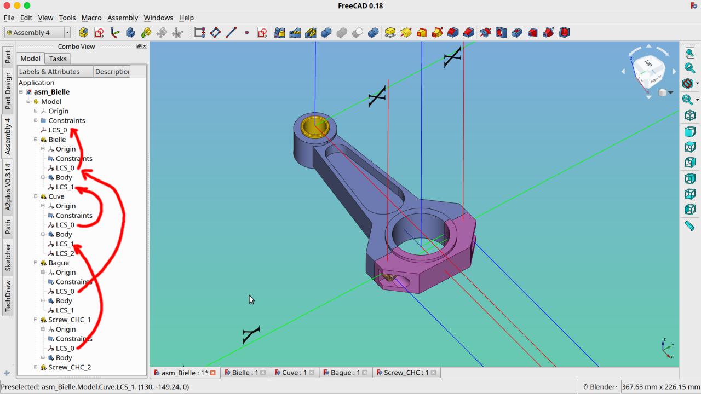
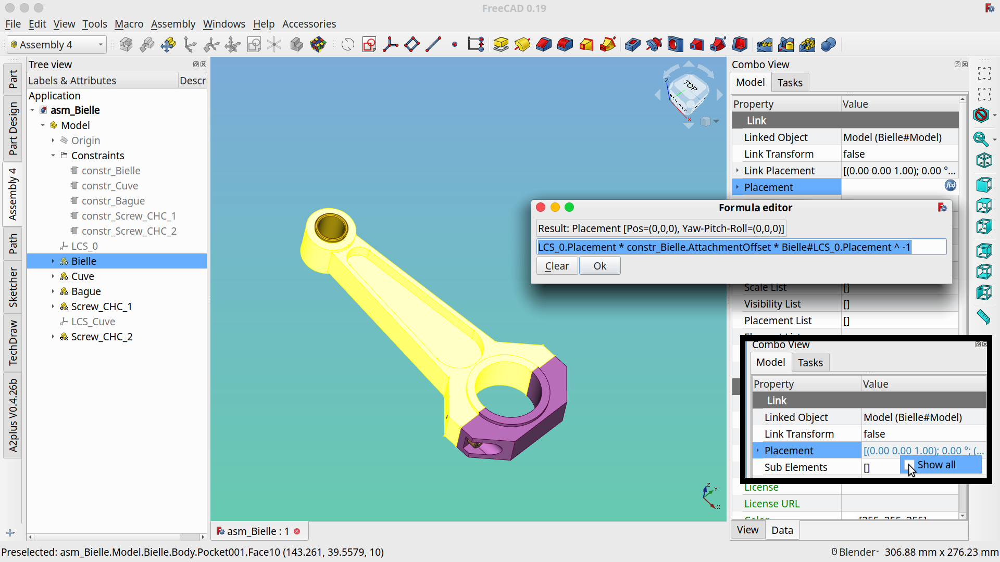
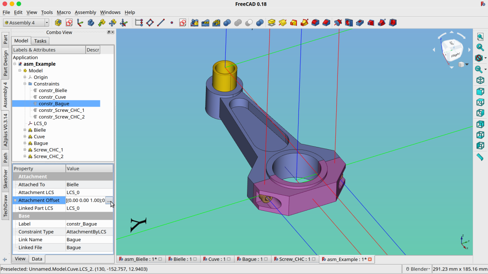
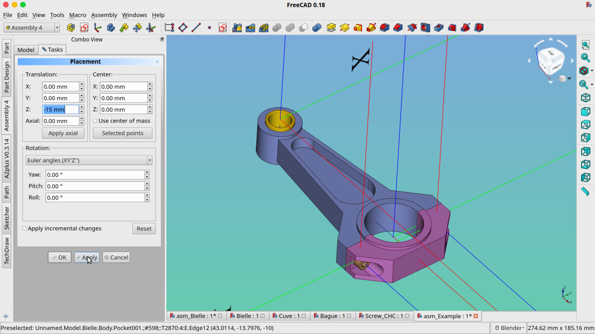
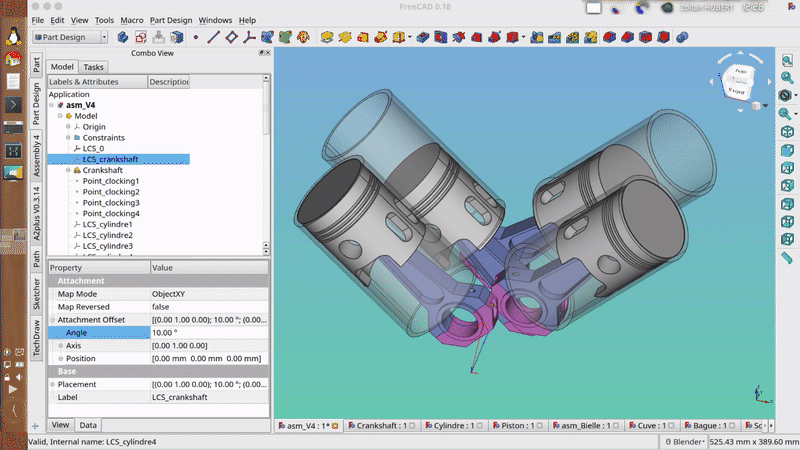

# FreeCAD Assembly Without Solver / Assembly 4
FreeCAD add-on for a bare-bone assembly structure, using App::Link  

Welcome to the FreeCAD_aws wiki! This page tries to explain how to make assemblies using these tools. This project the result of [discussions on the FreeCAD forum](https://forum.freecadweb.org/viewtopic.php?f=20&t=32843).

## Prerequisites

**Important Note:** Assembly 4 is **not** compatible with FreeCAD v0.18
- [x] FreeCAD >= `v0.19.18353`

## Installation

### Automatic Installation (recommended)

Assembly 4 is available through the [FreeCAD Addon Manager](https://github.com/FreeCAD/FreeCAD-addons/#1-builtin-addon-manager).
It is called 'Assembly4' in the Addon Repository.    

**Note:** Restarting FreeCAD is required after installing this Addon.

### Manual Installation

```bash
  cd ~/.FreeCAD/Mod  
  git clone https://github.com/Zolko-123/FreeCAD_Assembly4
```
To update the Addon:  

```bash
  cd ~/.FreeCAD/Mod/FreeCAD_Assembly4/
  git fetch
```

**Note:**
Another method is to download and extract the Github .zip archive. Then move (or link) the directory `A4` into the `~/.FreeCDA/Mod` folder, containing all additional modules.

**Important Note:** Restarting FreeCAD is required after installing this Addon.

## Getting Started

You can use the [example assemblies](https://github.com/Zolko-123/FreeCAD_Assembly4/tree/master/Examples) to experiment with this workbench's features. Open one _asm_something.fcstd_ file and try out the functions. There are `ReadMe.txt` files in each directory with some explanations.


## Principle

Each Assembly4 model is mostly standard FreeCAD `App::Part` object, and these are assembled using the `App::Link` framework included with FreeCAD 0.19. Pre-built binaries on the v0.19 development branch can be found [here](https://github.com/FreeCAD/FreeCAD/releases/tag/0.19_pre)

The particularities of the `App::Part` used as Assembly4 Model are the following:

* they are called 'Model' at creation time  
* they contain a group called 'Constraints' at the root  
* they contain a Datum Coordinate System called LCS_0 at the root  

Any Model can contain (by `App::Link`) any other Model and any FreeCAD `App::Part` and thus make an assembly, but a standard FreeCAD `App::Part` cannot be used by the Assembly4 workbench to include Parts or Models by App::Link. This is a purposfull feature to avoid burdensome error checking: it is supposed that no other usecase would create an `App::Part` called 'Model', _i.e._ that if an `App::Part` is called 'Model' it will conform to these characteristics. A FreeCAD document can contain many `App::Parts`, but only one `App::Part Model`.

The `App::Parts` that are to be linked by `App::Link` can be in the same document as the assembly or an extarnal document, invariably. Having the assembly and all its `App::Parts` in the same document can be handy for small 1-level assemblies, but for larger assemblies is is advised to split parts in various documents (files).

Linked parts are placed to each-other by matching their Datum Coordinate Systems (`PartDesign::CoordinateSystem`, called here-after LCS (Local Coordinate System)). There is no need for any geometry to be present to place and constrain parts relative to each other. LCS are used because they are both mechanical objects, since they fix all 6 degrees of freedom in an isostatic way, and mathematical objects that can be easily manipulated by rigorous methods (mainly combination and inversion).

To actually include some geometry, a body needs to be created, and designed using the PartDesign workbench. To be linked with the previously created model, this body needs to be inside the `App::Part container` called 'Model'.  

The result is the following:  


* the part _Bielle_ is placed in the assembly by attaching it's _LCS_0_ to the _LCS_0_ of the parent assembly. 
* the part _Cuve_ is placed in the assembly by placing its _LCS_0_ on the _LCS_1_ of the part _Bielle_
* the part _Bague_ is placed in the assembly by placing its _LCS_0_ on the _LCS_0_ of the part _Bielle_
* the parts _Screw_CHC_1_ and _Screw_CHC_2_ are placed in the assembly by placing their _LCS_0_ on the _LCS_1_ and _LCS_2_ of the part _Cuve_


## Usage


Assembly4 commands are accessible from the Assembly meny or the Assembly4 toolbar.


### Menu

Commands in the menu and the toolbar are activated with relevant selection. If a command you want to use is inactive try to change the selection (with the mouse).


### Toolbar

These functions are also accessible with the Assembly toolbar:


*  : **New Model** : creates an Assembly4 Model, which is a FreeCAD App::Part called Model and with some extra additions. One document can only contain one Assembly4 Model.

*  : **New Body** : creates FreeCAD PartDesign::Body in an Assembly4 Model or in an App::Part. This Body can then be used with FreeCAD's PartDesign workbench.

*  : **New Part** : creates FreeCAD App::Part in the current document. A document can contain many parts.

*  : **Insert an External Part** : creates a FreeCAD App::Link to an App::Part in another document. Only parts from documents already saved to disk can be used. If there are multiple parts in a document, they can be selected individually. A part can be inserted (linked) many times, but each instance must have a unique name in the assembly tree. If a name already attribuated is given again, FreeCAD will automatically give it a unique (and probably un-user-friendly) name.

*  : **Place Link** : this places a linked part in the assembly to its intended position. This attaches an LCS in the linked part to another LCS in the assembly (called target LCS). This target LCS can be either in the assembly itself (in the Model) or in a sister part already linked. In this case, only LCS at the root of the linked part can be used, and not LCS inside a Body (for example) in the linked part.

*  : **Fasteners dropdown** : Allows to insert screws, nuts and washers from the Fasteners Workbench, and allows to attach them to Assembly4 datum objects, primarily coordinate systems (LCS). If the Fasteners Workbench is not installed, these features are disabled. To install the Fasteners Workbench, go to the menu **Tools > Addon Manager > fateners**

    *  : **Insert Screw** : creates a normed screw from the Fasteners Workbench. The type of screw, diameter and length can be changed in the properties window of the screw.

    *  : **Insert Nut** : creates a normed nut from the Fasteners Workbench. The type of nut, diameter and length can be changed in the properties window of the nut.

    *  : **Insert Washer** : creates a normed washer from the Fasteners Workbench. The type of washer and its diameter can be changed in the properties window of the washer.

    *  : **Edit attachment of Fastener** : allows to attach an object from the Fasteners Workbench — screw, nut or washer — to a datum object in the assembly or a sister part, in the regular Assembly4 manner.

*  : **New Sketch** : creates FreeCAD Sketch in an App::Part (and thus also in Assembly4 Models). This Sketch is unattached, to attach it to an object edit its MapMode in its Placement Property
is placed in the assembly b
*  : **New Datum** : this is a drop-down combined menu grouping the creation of all Datum objects:

	*  : **New LCS** : creates FreeCAD PartDesign::CoordinateSystem in an App::Part (and thus also in Assembly4 Models). This LCS is unattached, to attach it to an object edit its MapMode in its Placement Property

	*  : **New Datum Plane** : creates FreeCAD PartDesign::Plane

	*  : **New Datum Axis** : creates FreeCAD PartDesign::Line

	*  : **New Datum Point** : creates FreeCAD PartDesign::Point

	*  : **New Hole LCS** : creates FreeCAD PartDesign::CoordinateSystem in an App::Part (and thus also in Assembly4 Models) at the center of te selected circular edge. This is therefore only active when a (single) circular edge is selected. This PartDesign::CoordinateSystem is attached to the center of the circle, and is intended to serve as attachment LCS for fasteners.  This is the combined function of creating an LCS and attaching it (via MapMode) to a circular edge, and is provided to streamline the workflow.

*  : **Place Datum** : this attaches an existing Datum object in the assembly to another existing Datum object in a linked part. Datum objects of different types can be attached. 

*  : **Import Datum** : this imports an existing Datum object from a linked part into the assembly. Precisely, it creates a Datum in the assembly and attaches it to a datum in a sister part of the same type. By default, the same name is given to the imported Datum object. 

*  : **Add Variable** : this adds a variable to the `Variables` object in the Model. These variables can be used in any parameter of the document by entering `Variables.Height` or `Variables.Length` (for example). This is especially useful for assemblies built in a single file, where several parts can be built using the same dimensions. Modifying a variable is done in the `Properties` window of the `Variables` object.

*  : **Solve constraints and update assembly** : this recomputes all the links and all the placements in the assembly


## ExpressionEngine

Assembly4 uses a special and very useful feature of FreeCAD, the **ExpressionEngine**. Some parameters can be entered through mathematical formulae, that are evaluated by this ExpressionEngine. For Assembly4, it's the parameter _`Placement`_ of the inserted _`App::Link`_ object that is calculated, such that 2 LCS - one in the linked part and the one in the assembly - are superimposed. 

In normal use, the ExpressionEngine of an _`App::Link`_ object is hidden, it must be shown as in the following screenshot:



### Syntax

The syntax of the ExpressionEngine is the following:

**If the LCS belongs to the parent assembly:**

  `LCS_parent.Placement * constr_LinkName.AttachmentOffset * LinkedPart#LCS_link.Placement ^ -1`

**If the LCS belongs to a sister part:**

  `ParentLink.Placement * ParentPart#LCS_parent.Placement * constr_LinkName.AttachmentOffset * LinkedPart#LCS.Placement ^ -1`

* **ParentLink** is the name of the App::Link of the sister part in the assembly
* **ParentPart** is the name of the App::Part that the previous ParentLink refers-to
* **LCS_parent** is the LCS in the parent part (can be either the assembly itself or a sister part in the assembly)
* **constr_LinkName** is a FeaturePython object with a conventional name
* **LinkedPart** is the App::Part's name that the inserted App::Link refers-to
* **LCS_link** is the LCS in the linked part

### Constraints

To each part inserted into an assembly is associated an `App::FeaturePython` object, placed in the 'Constraints' group. This object contains information about the placement of the linked object in the assembly. It also contains an `App::Placement`, called '`AttachmentOffset`', which introduces an offset between the LCS in the part and the LCS in the assembly. The main purpose of this offset is to correct bad orientations between the 2 matching LCS. 


**Note:** These constraints are not really constraints in the traditional CAD sense, but since `App::FeaturePython` objects are very versatile, they could be expanded to contain real constraints in some (distant) future.



_Taking a closer look at the fields contained in an `App::FeaturePython` object associated with the part 'Bague'. The small button under the cursor opens the dialog that allows to edit the parameters of the Attachment Offset_



_Dialog that opens when clicking the previous small button, and permitting to edit the parameters of the_ `App::Placement` _called_ 'AttachmentOffset' _in the constraint associated with a link, and allowing relative placement of the link -vs- the attachment LCS_


## Workflow


### Part

The basic workflow for creating a part is the following:

* Create a new document, create a new 'Model' with the macro 'new_Model'. This will create a new App::Part called 'Model' with the default structure
* Create or import geometries in bodies (`PartDesign::Body`)
* Create LCS with the macro 'new_ModelLCS', and place them wherever you feel they're useful. Use the MapMode to attach the LCS
* Save part (only saved parts can be used currently). If necessary, close and re-open the file
* Repeat

### Assembly

The basic workflow for creating a part is the following:

* Create a new document, create a new 'Model'
* Create a new sketch with the 'new_ModelSketch' macro. Attach it to whatever is useful, and draw the skeleton of the assembly, placing vertices and lines where useful
* Create new LCS (with the new_ModelLCS macro) and place them on the correct vertices of the sketch (using MapMode)
* Save document
* Import a part using the 'link_Model' macro. It will place your part with its LCS_0 to the LCS_0 of the assembly. You should give it a recognisable name. 
* Select the link in the tree, and execute the macro 'place_Link'. Select the LCS of the part that you want to use as attachment point, select the part that you want it to be attached, and select the LCS in that part where you want the part to be attached. Click 'Apply'. 
* If the placement corresponds to your needs, click 'Ok', else select other LCS / Part until satisfied
* If the part is correctly paced but badly oriented, select the corresponding constraint in the 'Constraints' folder, select the property 'Offset', and modify its parameters. Click 'Apply'. Repeat until satisfied

### Nested Assemblies

The previous method allows to assemble parts within a single level.  
But this workbench also allows the assembly of assemblies: since there is no difference between 
parts and assemblies, the 'Insert External Part' allows to chose a part that has other parts linked to it. 
The only difference will be for the coordinate systems in the inserted assemblies: in order to be used 
with Assembly 4, a coordinate system must be directly in the root 'Model' container, meaning that a 
coordinate system inside a linked part cannot be used to attach the assembly to a higher-level assembly.

Therefore, in order to re-use a coordinate system of a part in an assembly, a coordinate system must be created at the root of the 'Model', and the placement of this coordinate system must be 'copied' over from the coordinate system that the user wants to use. This is done by inserting a coordinate system and using the 'Place LCS' command, which allows to select a linked part in the assembly and one of it's coordinate systems: the 2 coordinate systems — the one at the root of 'Model' and the one in the linked part — will always be superimposed, even if the linked part is modified, allowing the placement of the assembly in a higher level assembly using a linked part as reference. It sounds more complicated than it actually is.




## License

LGPLv2.1 (see [LICENSE](LICENSE))
