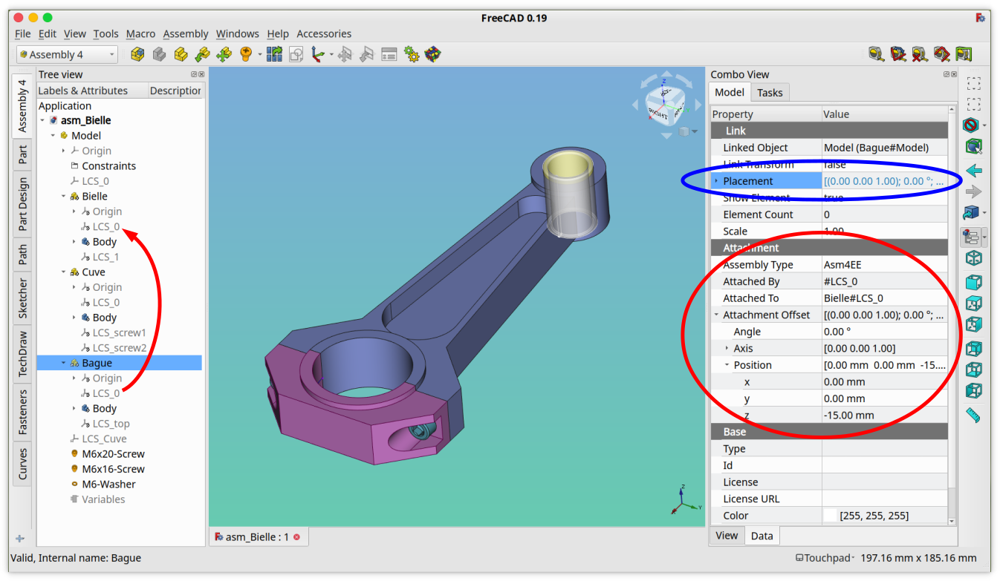
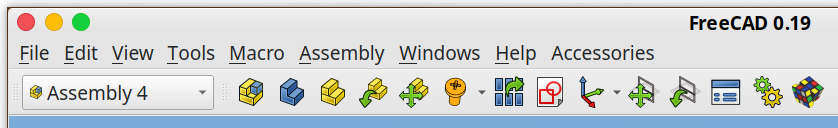
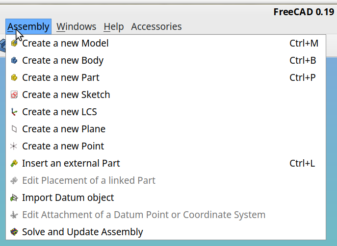
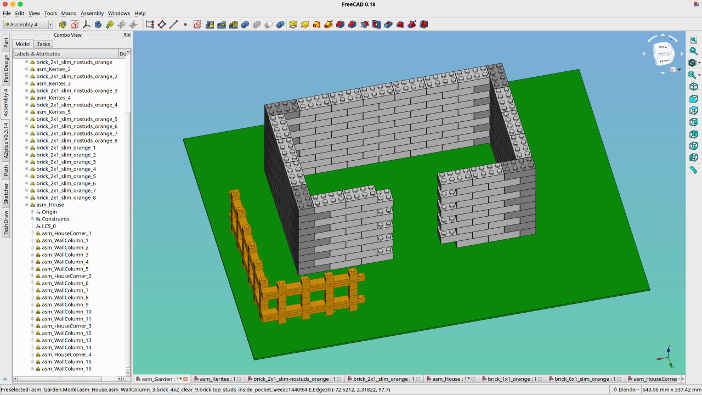

# FreeCAD Assembly 4 workbench user instructions

These instructions present the intended usage and workflow to assembly design using FreeCAD's Assembly4 workbench. It is intended for all users.

## Installation

The recommended way to install Assembly4 is through FreeCAD's [Addon Manager](https://github.com/FreeCAD/FreeCAD-addons/#1-builtin-addon-manager): **Menu > Tools > Addon Manager**. It is called *Assembly4* in the addon repository. Should this fail, please read the **Installation** section in the [technical manual](TECHMANUAL.md) for possible solutions.

**Important Note:** Assembly 4 is **not** compatible with FreeCAD v0.18, and needs FreeCAD >= `v0.19.18353`

**Important Note:** Assembly 4 is **not** compatible with Assembly2+ and Assembly3.

## Principle

We present here a short summary of the inner workings of FreeCAD's Assembly4 workbench. For those interested in more technical details please read the [technical manual](TECHMANUAL.md).

### Data structure

The very principle of Assembly4 is that `App::Part` objects are linked together using the `App::Link` interface introduced in FreeCAD v0.19. The host parent assembly **and** the included child parts are all `App::Part` type objects. The parts that are linked can be in the same document as the assembly or an external document, invariably.

Since a FreeCAD `App::Part` is a container, all objects included in the child part will be included in the parent assembly. To actually insert some geometry, solids or bodies need to be created inside the `App::Part` container and designed using other FreeCAD workbenches.

**Please Note:** objects in the same document as the linked part but outside the `App::Part` container will not be inserted. The *PartDesign* workbench doesn't produce **Parts**, it produces **Bodies**. It is entirely possible to use Parts made with the *Part* workbench with Assembly4, but if you want to use Bodies made with the PartDesign WB you need first to create a Part and move the Body into that Part.

### Part placements

Instances of linked parts are placed in the assembly using their *Placement* property, visible and accessible in their *Property* window. This *Placement* property can be calculated in various ways:

* manually, by setting the parameters in the *Placement* property fields or by using the **Transform** tool (right-click > Transform)
* by using Assembly4's **Place linked part** tool, which sets an *ExpressionEngine* into the *Placement* property.

When using Assembly4's tool, a local coordinate system in the child part and one in the host parent assembly are matched (superimposed). This is somewhat different from constraints that some other CAD systems use, but once used to it this approach is very powerful.

The result is the following:  

In this example, the instance *Bague* is highlighted:

* the blue circle shows the *Placement* property 
  * the blue text in the *Value* field indicates that the *Placement* is calculated by the *ExpressionEngine*
* the red circle shows the properties of this instance:
  * *Assembly Type* `Asm4EE` indicates that it's an Assembly4 object
  * *Attached By* `#LCS_O` indicates that the child part's *LCS_0* is the reference to insert the part into the assembly
  * *Attached To* `Bielle#LCS_O` indicates that this instance is attached to the child instance *Bielle* (this is the name of the child instance in this assembly and not that of the original part !) and in that child it is targeted at _LCS_0_
  * the *Attachment Offset* property allows to offset the child's attachment LCS w.r.t. the target LCS. In this example, the child instance *Bague* is offset in the Z-direction by -15mm

All Assembly4 children have these 4 properties; these are the first places to check if something in your assembly doesn't behave as expected.

## Usage

Assembly4 commands are accessible from the Assembly menu or the Assembly4 toolbar.

### Toolbar

Commands are activated with relevant selection. If a command is inactive (grayed out) it's because something is selected to which that function doesn't apply.

### Menu

  
These functions are also accessible from the Assembly menu:
 

### Assembly4 commands

*  : **New Model** : creates an Assembly4 *Model*, which is a FreeCAD `App::Part` called *Model* and with some extra additions. This can be used to design a stand-alone part or be the container for an assembly. One document can only contain one Assembly4 Model.

*  : **New Body** : creates FreeCAD `PartDesign::Body` in the selected `App::Part`. This Body can then be used with FreeCAD's PartDesign workbench. If you create such a `PartDesign::Body` with the PartDesign workbench, it will be placed at the root of the document, outside any `App::Part`.

*  : **New Part** : creates FreeCAD `App::Part` in the current document and allows to give it a name. A document can contain many parts.

*  : **Link to a Part** : creates a FreeCAD `App::Link` to an `App::Part`. Only parts from documents already open in the session and saved to disk can be used. If there are multiple parts in a document, they can be selected individually. A part can be inserted (linked) many times, but each instance must have a unique name in the assembly tree. If a name already attribuated is given again, FreeCAD will automatically give it a unique (and probably un-user-friendly) name.

*  : **Place Link** : this positions the child instance of a linked part in the current host assembly. This attaches an LCS in the linked part to a target LCS in the assembly. This target LCS can be either in the assembly itself (in the *Model*) or in a sister part already linked. In this case, it is important to note that only LCS at the root of the linked part can be used.

*  : **Fasteners dropdown** : Allows to insert industry standard screws, nuts and washers from the **Fasteners Workbench** library, and allows to attach them to Assembly4 datum objects, primarily coordinate systems (LCS). These features are only available if the Fasteners Workbench is installed. The Fasteners Workbench can be installed like Assembly4 through FreeCAD's addon manager: menu **Tools > Addon Manager > fasteners**

    *  : **Insert Screw** : creates a normed screw from the Fasteners Workbench. The type of screw, diameter and length can be changed in the properties window of the screw after creation.

    *  : **Insert Nut** : creates a normed nut from the Fasteners Workbench. The type of nut, diameter and length can be changed in the properties window of the nut after creation.

    *  : **Insert Washer** : creates a normed washer from the Fasteners Workbench. The type of washer and its diameter can be changed in the properties window of the washer after creation.

    *  : **Edit attachment of Fastener** : allows to attach an object from the Fasteners Workbench — screw, nut or washer — to a datum object in the assembly or a sister part, in the regular Assembly4 manner.

*  : **New Sketch** : creates FreeCAD Sketch in an `App::Part` (and thus also in Assembly4 Models). After creation the attachment dialog opens and allows to attach this Sketch.

*  : **New Datum** : this is a drop-down combined menu grouping the creation of all Datum objects:

	*  : **New LCS** : creates `PartDesign::CoordinateSystem` in an `App::Part` (and thus also in Assembly4 Models). This LCS is unattached, to attach it to an object edit its MapMode in its Placement Property

	*  : **New Datum Plane** : creates a datum `PartDesign::Plane`

	*  : **New Datum Axis** : creates a datum `PartDesign::Line`

	*  : **New Datum Point** : creates a datum `PartDesign::Point`

	*  : **New Hole LCS** : creates datum `PartDesign::CoordinateSystem` in an `App::Part` (and thus also in Assembly4 Models) at the center of the selected circular edge. This is therefore only active when a (single) circular edge is selected. This `PartDesign::CoordinateSystem` is attached to the center of the circle, and is intended to serve as attachment LCS for fasteners.  This is the combined function of creating an LCS and attaching it (via MapMode) to a circular edge, and is provided to streamline the workflow.

*  : **Place Datum** : this attaches an existing Datum object in the assembly to another existing Datum object in a linked part. Datum objects of different types can be attached. 

*  : **Import Datum** : this imports an existing Datum object from a linked part into the assembly. Precisely, it creates a Datum in the assembly and attaches it to a datum in a sister part of the same type. By default, the same name is given to the imported Datum object. 

*  : **Add Variable** : this adds a variable to the `Variables` object in the Model. These variables can be used in any parameter of the document by entering `Variables.Height` or `Variables.Length` (for example). This is especially useful for assemblies built in a single file, where several parts can be built using the same dimensions. Modifying a variable is done in the `Properties` window of the `Variables` object.

*  : **Animate Assembly** : allows to select one of the variables from the `Variables` object and sweep it between two values. All parameters of the assembly that are set by this variable will be updated. 

*  : **Solve constraints and update assembly** : this recomputes all the links and all the placements in the assembly

## Workflow

Some general purpose 3D CAD systems propose a workflow based on finished parts that are assembled into an assembly, and their position in that assembly is determined by constraints imposed on geometrical features present in the parts: holes, edges, faces... While this is quite easy to understand for beginners, it poses some limits on advanced users who need to modify the parts that are already inserted into an assembly. For example, if a part is placed using some geometrical feature, and that feature is later modified during the design process, the assembly solver might not be able to find the original constraint because the geometrical feature on which it was based has disappeared, and will throw an error. This can be a very difficult problem to solve, and is due to the dreaded *topological naming* issue. 

Therefore, this is not the workflow used in Assembly 4, and instead Assembly 4 uses the principle of a **master sketch** : at the root of the assembly, *i.e.* in the Assembly 4 *Model*, one — or more — sketches are drawn that represent the "skeleton" of the assembly. This skeleton matches the functionalities of the assembly, and holds elements such as points and lines at characteristical positions of the assembly: rotational axes, fixation points, translation axes, beam directions... Furthermore, local coordinate systems — technically these are `PartDesign::CoordinateSystem` type objects and are called **LCS** in Assembly 4 — are placed on these characteristical points. The same principle — local coordinate systems at characteristical locations — is also applied in the design process of parts. Thus, the local coordinate systems in the parts can be matched to local coordinate systems in the assembly, guaranteeing that the part is positioned in the assembly at its intended position.

### Part

The basic workflow for creating a part is the following:

* Create a new document, create a new 'Model' with the macro 'new_Model'. This will create a new App::Part called 'Model' with the default structure
* Create or import geometries in bodies (`PartDesign::Body`)
* Create LCS with the macro 'new_ModelLCS', and place them wherever you feel they're useful. Use the MapMode to attach the LCS
* Save part (only saved parts can be used currently). If necessary, close and re-open the file
* Repeat

### Assembly

The basic workflow for creating a part is the following:

* Create a new document, create a new 'Model'
* Create a new sketch with the 'new_ModelSketch' macro. Attach it to whatever is useful, and draw the skeleton of the assembly, placing vertices and lines where useful
* Create new LCS (with the new_ModelLCS macro) and place them on the correct vertices of the sketch (using MapMode)
* Save document
* Import a part using the 'link_Model' macro. It will place your part with its LCS_0 to the LCS_0 of the assembly. You should give it a recognisable name. 
* Select the link in the tree, and execute the macro 'place_Link'. Select the LCS of the part that you want to use as attachment point, select the part that you want it to be attached, and select the LCS in that part where you want the part to be attached. Click 'Apply'. 
* If the placement corresponds to your needs, click 'Ok', else select other LCS / Part until satisfied
* If the part is correctly paced but badly oriented, select the corresponding constraint in the 'Constraints' folder, select the property 'Offset', and modify its parameters. Click 'Apply'. Repeat until satisfied

### Nested Assemblies

The previous method allows to assemble parts within a single level.  
But this workbench also allows the assembly of assemblies: since there is no difference between 
parts and assemblies, the 'Insert External Part' allows to chose a part that has other parts linked to it. 
The only difference will be for the coordinate systems in the inserted assemblies: in order to be used 
with Assembly 4, a coordinate system must be directly in the root 'Model' container, meaning that a 
coordinate system inside a linked part cannot be used to attach the assembly to a higher-level assembly.

Therefore, in order to re-use a coordinate system of a part in an assembly, a coordinate system must be created at the root of the 'Model', and the placement of this coordinate system must be 'copied' over from the coordinate system that the user wants to use. This is done by inserting a coordinate system and using the 'Place LCS' command, which allows to select a linked part in the assembly and one of it's coordinate systems: the 2 coordinate systems — the one at the root of 'Model' and the one in the linked part — will always be superimposed, even if the linked part is modified, allowing the placement of the assembly in a higher level assembly using a linked part as reference. It sounds more complicated than it actually is.

## Tutorials and Examples

You can use the [example assemblies](https://github.com/Zolko-123/FreeCAD_Examples) to experiment with this workbench's features. Open one _asm_something.fcstd_ file and try out the functions. There are `ReadMe.txt` files in each directory with some explanations. There are tutorials available to lear tu use Assembly4:

* [a quick assembly from scratch](https://github.com/Zolko-123/FreeCAD_Examples/blob/master/Asm4_Tutorial1/README.md)
* [a cinematic assembly in one file, using a master sketch](https://github.com/Zolko-123/FreeCAD_Examples/blob/master/Asm4_Tutorial2/README.md)
* [a Lego assembly](https://github.com/Zolko-123/FreeCAD_Examples/tree/master/Asm4_Tutorial3)

## License

LGPLv2.1 (see [LICENSE](LICENSE))
