# FreeCAD Assembly 4 Tutorial 1

## A quick starter guide. 

It is supposed that you have read the [basic instructions](INSTRUCTIONS.md) and that the Assembly4 workbench has been installed before. It is also supposed that you have basic knowledge of FreeCAD, especially the _PartDesign_ workbench.

## Toolbar and Menu

Buttons in the toolbar are activated with relevant selection. If a button you want to use is inactive try to change the selection (with the mouse).

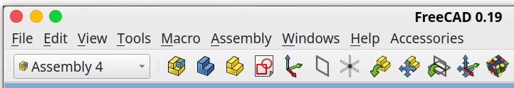

These functions are also accessible with the Assembly menu:

## Create the documents

We start with an empty FreeCAD. 

* Create 3 new documents: menu File > New (or CTRL-N)
* In each document, create a new Model: menu Assembly > Create a new Model (or CTRL-M)
* Save each document in the same directory. Call them:
	* asm_tuto1.fcstd
	* axis.fcstd
	* bearing.fcstd
* Close all 3 documents (you don't need to close FreeCAD)
* Re-open all 3 documents 

These documents are now ready to be used by Assembly4. 

## Document "axis"

Switch to document "_axis_" (by clicking on its tab). 

### Body

* Create a new Body
* Make body active (right-click on Body and in the contextual menu > Toggle active body). This will switch to the PartDesign workbench
* Create a new Sketch (should be in the active body). In the Task view, select XY_Plane
* Draw the following sketch:

* Make a revolution of the Sketch:

### LCS_1

* Switch to Assembly4 workbench
* Select the root Model (remember it's an App::Prt)
* Create a new LCS. This can also be done by right-clicking on the Model in the tree, and in the contextual menu Create > Create a new LCS.
* Edit its MapMode in the Placement in its Property View (see inlay in screenshot below on how to activate it)
* Choose the circle as shown:

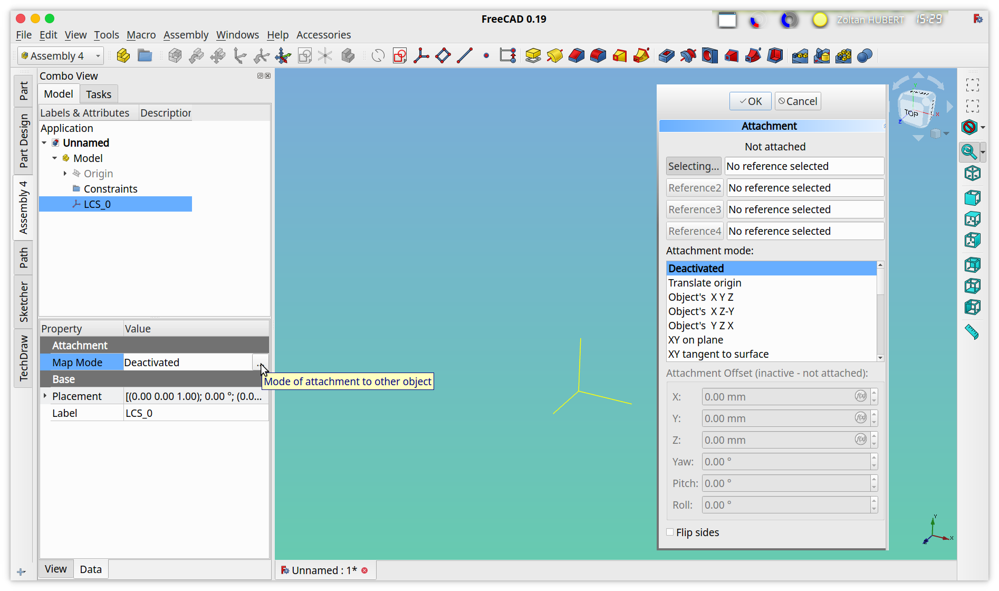

* Click OK

* ignore the warning : 

`PartDesign::CoordinateSystem / LCS_1: Links go out of the allowed scope`

* In order to make our life easier later, we'll change the basic colour of the Body: right-click on the Body in the Model tree, and choose _Appearence_ . In the _Display Properties_ dialog change the _Shape color_ to something fancy. 

* Save

The part _axis_ is now ready for assembly

## Document "bearing"

Switch to document "_bearing_" (by clicking on its tab). Download the STEP file [bearing_20x37x9.stp ](parts/bearing_20x37x9.stp ) to the same local directory as the 3 documents _axis.fcstd_ , _bearing.fcstd_ , _asm_tuto1.fcstd_ . 

Direct Link to [bearing_20x37x9.stp](https://github.com/Zolko-123/FreeCAD_Assembly4/raw/master/Resources/parts/bearing_20x37x9.stp)

### STEP import

* Import the step file bearing_20x37x9.stp : menu File > Import. This will create a bunch of solids in the bearing document, but not in the Model ! 

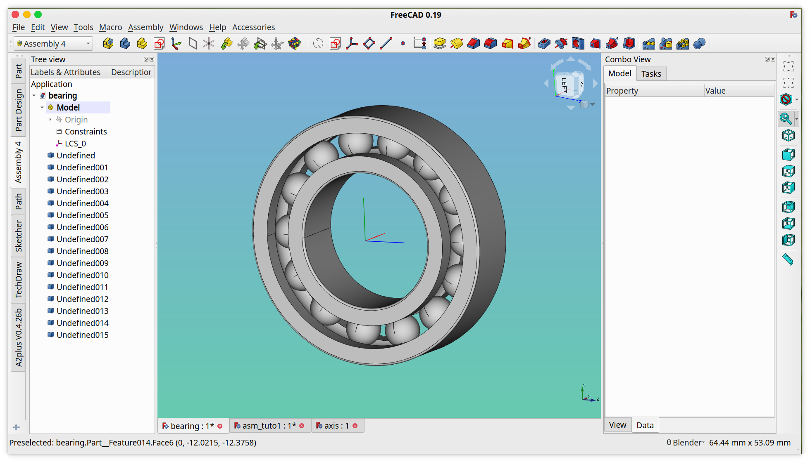

* Select in the Model tree all the imported solids and drag them over the Model (in the tree). Note how a the cursor changes to a small hand and an arrow appear close to the cursor meaning that the solids are moved:

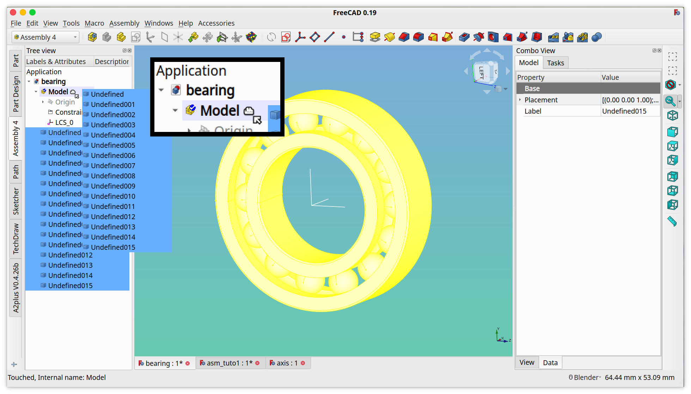

* You can check that the solids have indeed been moved by collapsing the Model tree (with the small triangle) and hoovering over the Model in the tree with the mouse. If it didn't work fix it. If necessary, delete the file _bearing.fcstd_ and begin again.

### LCS

* In order the place this bearing in the assembly, we will need 2 LCS, each in the centre, but each on 1 side. _LCS_0_ **looks** like it is in the centre, but one can never trust a STEP import  so we will create 2 new LCS and place them in the centre of the geometry. 
  * Select the Model in the tree view
  * Create a new LCS and leave the default name LCS_1
  * Create a new LCS and leave the default name LCS_1
  * 2 LCS have been created, LCS_1 and LCS_1001. Rename LCS_1001 to LCS_2 (right-click and choose Rename)

* Now place LCS_1: select LCS_1 in the tree, toggle its MapMode, select an edge as shown in the screenshot below, and choose the option _Concentric_ :

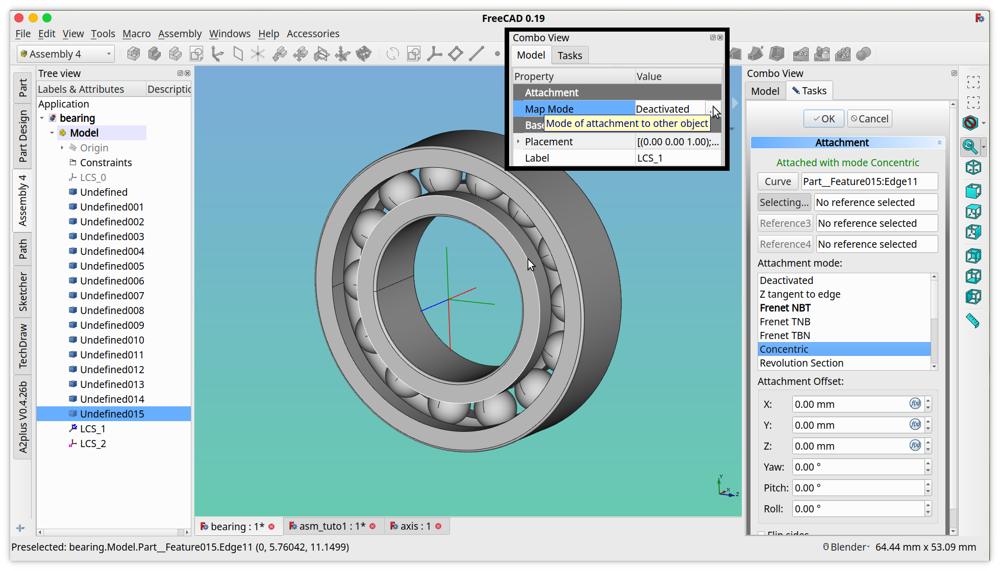

* Click OK

* Now place LCS_2: select LCS_2 in the tree, toggle its MapMode, select an edge as shown in the screenshot below, and choose the option _Concentric_ :

* Click OK

* Save

The part _bearing_ is now ready for assembly

## Document "asm_tuto1"

* Switch to document _asm_tuto1_

### Insert axis

* Click on Insert External part

* This will bring up the following dialog:

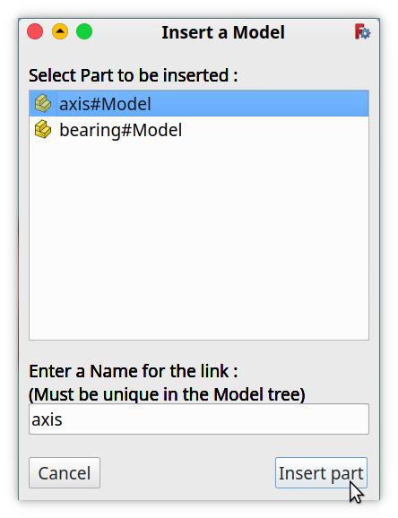

* Select axis#Model

* Leave the proposed default name _axis_ 

* Click _Insert part_, it will bring up the _Place Link_ dialog:

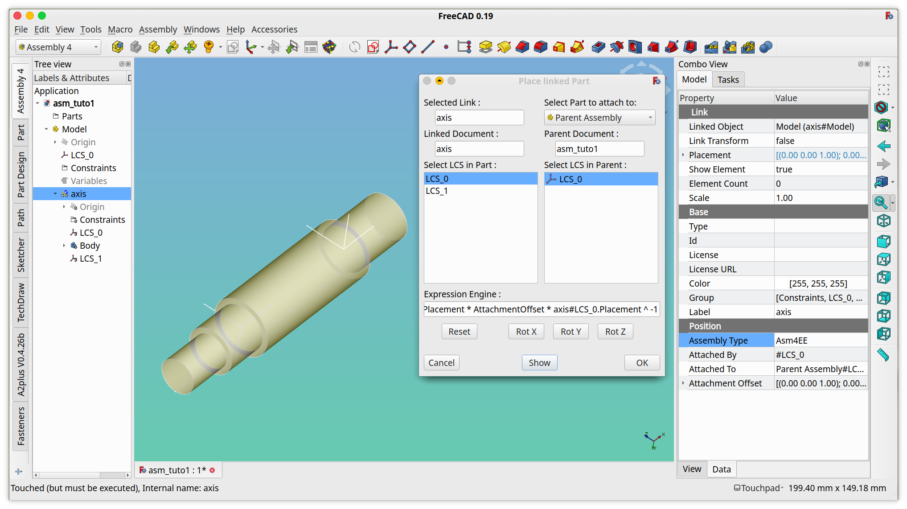

* Make the same selections as in the screenshot above

* Click Show

* This has filled the `Expression Engine` field and an object called _constr_axis_ has appeared in the Constraints group.
* Click OK

* Note that the _axis_ part is now in the _asm_tuto1_ document, including the tree, with all its sub-objects.

* Save 

### Insert bearing 1

* Click on Insert External part, select bearing#Model

* Change the proposed name _bearing_ to _bearing_1_ (we will have 3 bearings)

* Click Insert

* This will bring up the _Place Link_ dialog: 
  * in the left panel _Select LCS in Part_ choose _LCS_1_
  * in the drp-down combo-box _Select part to attach to_ choose part _axis_
  * in the right panel _Select LCS in Parent_ choose _LCS_0_
  * Click _Show_

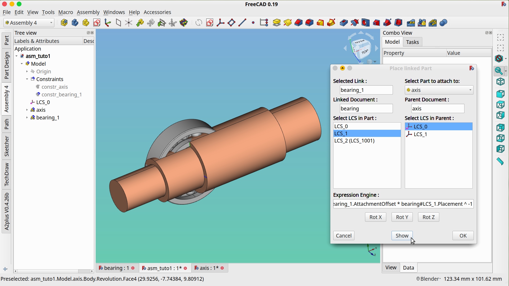

As you can see, this has placed the bearing but in an awkward orientation. This is normal, and it's due to the different orientations of the LCS during their mapping. This is easy to correct:

* Click on the _Rot X_ and _Rot Y_ and _Rot Z_ buttons until the bearing is in its correct position and orientation. You can either spend a lot of time thinking around which axis (X-Y-Z) to rotate, or wildly try everything until it fits. The result will be the same:

* In this case 1 _Rot Y_ was needed. 

* Click _OK_

Now we can see why it was useful to change the axis colour. 

### Insert bearing 2

* Click on Insert External part, select bearing#Model

* Change the proposed name _bearing_ to _bearing_2_

* Click Insert

* This will bring up the _Place Link_ dialog: 
  * in the left panel _Select LCS in Part_ choose _LCS_1_
  * in the drp-down combo-box _Select part to attach to_ choose part _bearing_2_
  * in the right panel _Select LCS in Parent_ choose _LCS_2(LCS_1001)_ : When an LCS has been renamed (as we did in the _bearing_ part) this is how it appears.
  * Click _Show_
  

* This time the orientation is correct, click _OK_

### Insert bearing 3

* Click on Insert External part, select bearing#Model

* Change the proposed name _bearing_ to _bearing_3_

* Click Insert

* This will bring up the _Place Link_ dialog: 
  * in the left panel _Select LCS in Part_ choose _LCS_1_
  * in the drp-down combo-box _Select part to attach to_ choose part _bearing_2_
  * in the right panel _Select LCS in Parent_ choose _LCS_2(LCS_1001)_ : When an LCS has been renamed (as we did in the _bearing_ part) this is how it appears.
  * Click _Show_
  * Orient _bearing_3_ with the buttons _Rot X_ and _Rot Y_ and _Rot Z_ until it is in its correct position

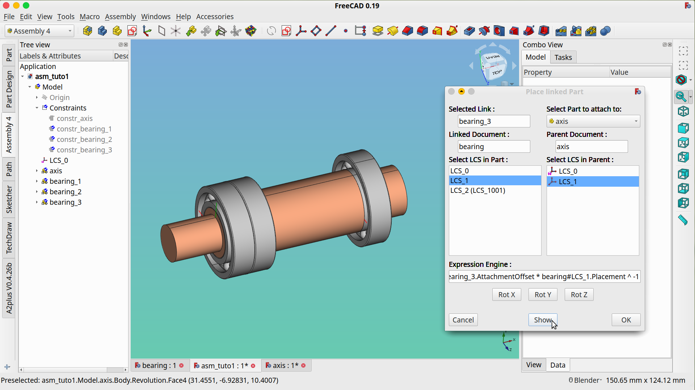

* Click _OK_

We are nearly done. 

### Offset bearing 3

In real-life, this would be a lead screw with a standard 3-bearings mount, where the 2 bearings facing each other are diagonal contact bearings that can also take thrust, and the 3rd lone bearing is a deep groove ball bearing. In order to not overconstrain the axis, the 3rd bearing must't touch the flange of the axis, there must be some room to allow for temperature dilatation compensation. 

This is where the **constr_Feature** comes in. 

* Select _constr_bearing_3_ in the Model tree

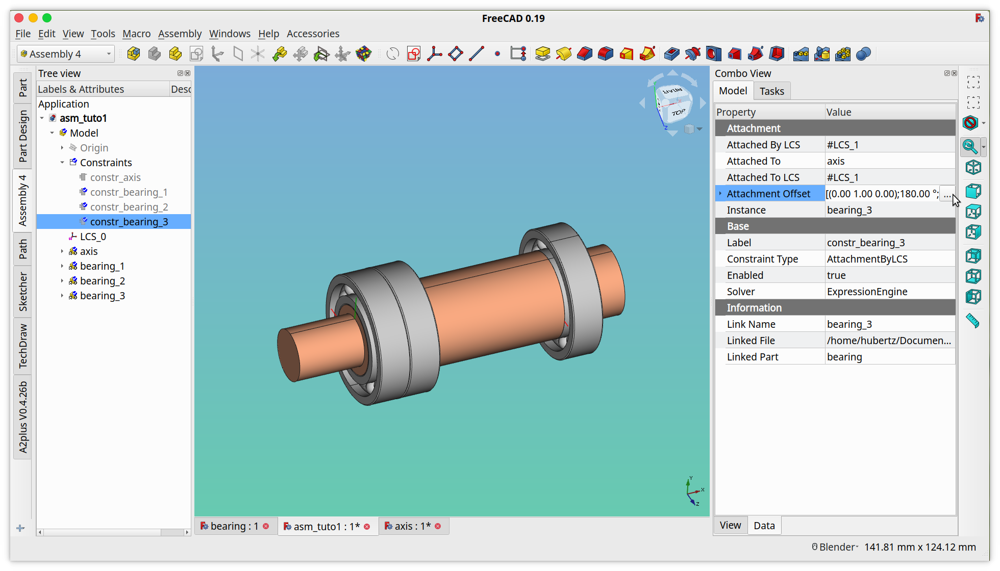

* Open the _MapMode_ of the _AttachmentOffset_ property

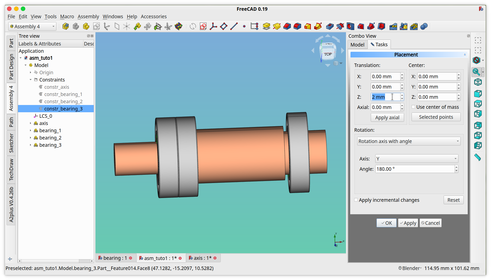

* In the field Z type 2mm

* Click Apply

* Click OK

* Save

* Click _Yes_

Now your first Assembly4 assembly is finished....

### Check

...but or course we want to check wheteher all went according to plan.

* Close all 3 documents

* Re-open asm_tuto1.fcstd

* Ignore the warnings: "
`Enumeration index -1 is out of range, ignore it` "

* In the Model tree, right-click on _Sketch_ in the _Body_ in the part _axis_ and choose Edit Sketch

* Modify the Sketch like in the screenshot below:

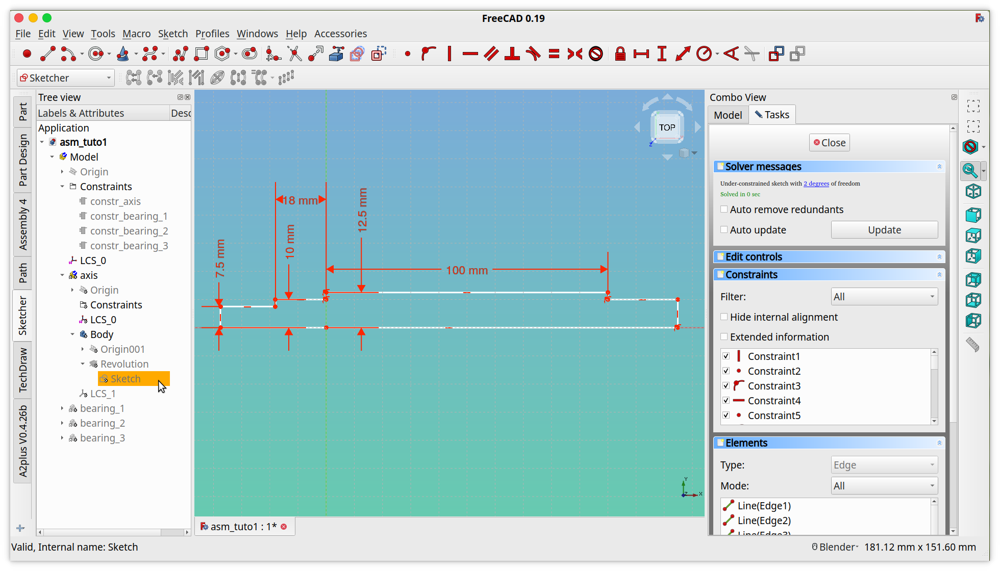

* Click _Close_

* The assembly has updated, the axis is longer, and all the bearings have followed:

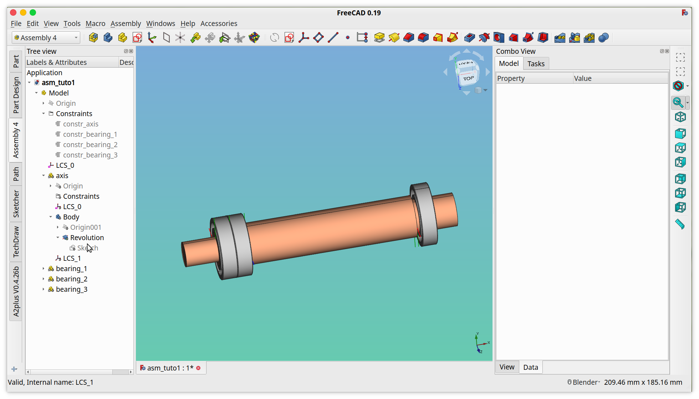

By right-clicking on the Body inside axis, you can **Toggle active body** and edit it with PartDesign, modifying and adding features, like for example a chamfer:

Should it happen that you make modifications in the assembly and some parts didn't follow, right-click on that part and choose in the contextual menu _Recompute object_ . You can also do this on the top level assembly _Model_ 

