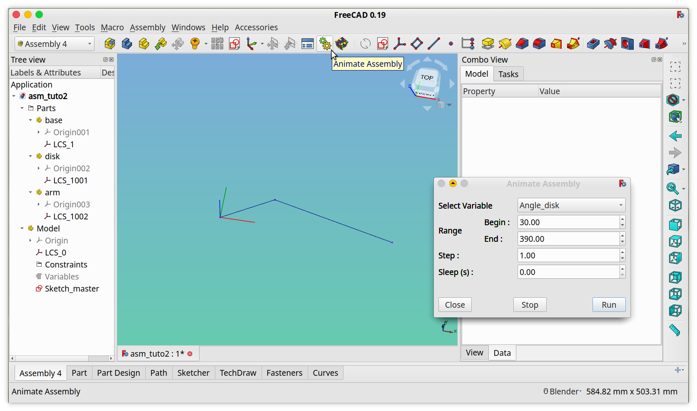
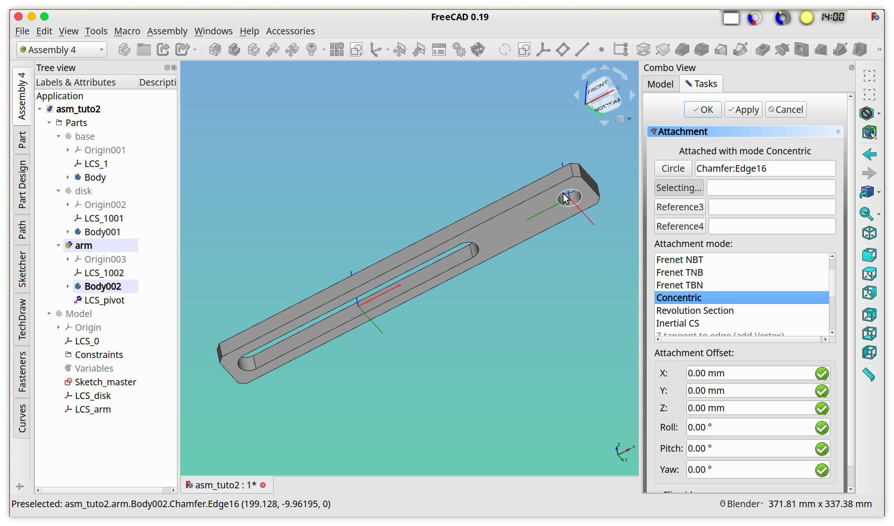
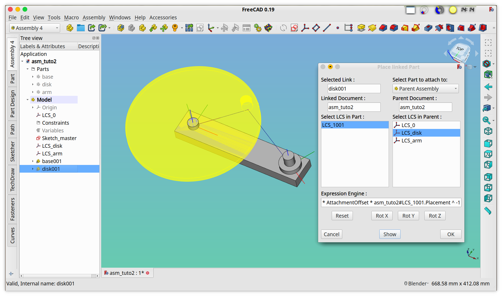
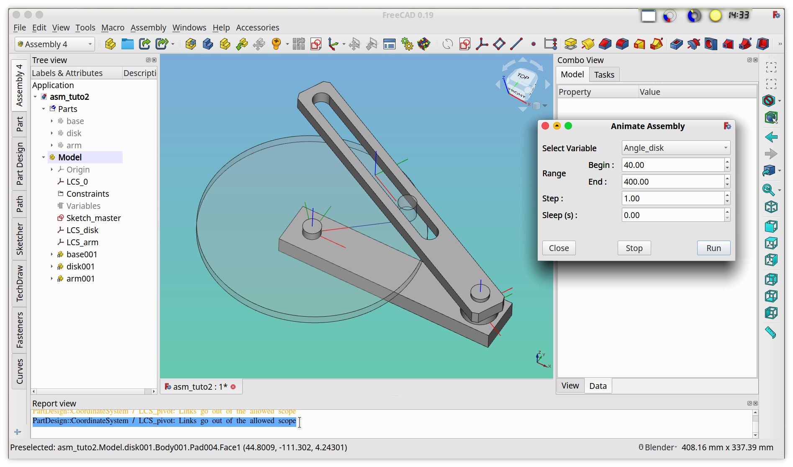

# FreeCAD Assembly 4

## Tutorial 2

In this tutorial we'll assemble 3 parts inside a single FreeCAD document, and animate the movement using a maseter-sketch:

* the base is fixed and holds 2 axes
* the disk rotates around one of the axes
* the arm can wiggle around the base's other axis
* the disk has a nipple that is prisoner in a slot in the arm
* all 3 parts and the full assembly are in 1 single FreeCAD file

### Prerequisites

It is assumed that you have completed the [1st Assembly4 tutorial](TUTORIAL1.md) and that you have some experience with designing with FreeCAD, especially the _PartDesign_ and _Sketcher_ workbenches.

## Create the document and the parts:

We start with an empty FreeCAD:

* Create a new document: **File > New** (or _ctrl-n_)
* In that document, create a new Assembly4 Model: **Assembly > Create a new Model** (or _ctrl+m_)
* Create also 3 new Parts: **Assembly > Create a new Part**, and call them
  * _base_
  * _disk_
  * _arm_
* Note that these 3 parts are in the _Parts_ group
* Save the document and call it _asm_tuto2.fcstd_ 

**Result:** The document is now ready to be used by Assembly4. 

## Master-sketch

We will first create the functional structure of the assembly, and only then will we design the parts composing the assembly. The functional structure constist of sketches and datum objects at the root of the assembly, and placed at real functional locations, like rotation axes, planes, fixation points, translation axes ... 

We present here a way of doing an assembly — a _functional_ assembly as opposed to a _geometrical_ assembly — that is based on the real mechanical functions of the assembly, and not on the geometrical features of the parts in the assembly. It is interesting to note that, _in fine_, all assemblies are functional assemblies, but when making a geometrical assembly you somehow reverse-engineer the functions of the geometrical features that the designer of the part has implemented to match the mechanical functions of the part. In other words, if, for example, there is a — _geometrical_ — hole in a part to hold an axis, it's because the designer new that there is going to be a — _functional_ — rotation there, and not because of some lucky magic. 

Such a functional assembly is also called _top-down_ design, as opposed to _bottom-up_ design where you assemble finished parts.

At first glance, this functional assembly, or top-down design, might seem less intuitive than the geometrical assembly that most CAD software propose, but once used to it it is more natural, and also much more robust: if, for example, you define a datum axis for a rotation, you don't need to know the mechanical details of how you will realise the rotation, and you can already assemble your parts around that datum axis. It is therefore possible to split and parallelize the detail design of each part between designers and still be sure that all the parts will come correctly together. 

### Variables

We will create variables that drive our assembly. First, create a variable that is the angle of rotation of the disk w.r.t. the base:

* Create a new variable: **Assembly > Add variable**
* Choose the Type : _Float_ (this a decimal floating-point number)
* Name it: Angle_disk
* Set default value to 30.00
* Click **OK**

Create in the same way 2 other variables for the disk radius (_R_disk_ with value 100.00) and the distance of the arm's pivot (_Dist_pivot_ with value 300.00).

**Result:** We have created numercial variables in the _App::FeaturePython_ object called _Variables_ (see Model tree), that can be used in the _ExpressionEngine_ of any parameter in this the document with: _Variables.Angle_disk_ , _Variables.Dist_pivot_ and _Variables.R_disk_ 

### Sketch

We will now create the proper master sketch of our assembly:

* In the model tree, select the _Model_
* Create a new sketch: **Assembly > New sketch**
* Call it _Sketch_master_ 
  * This will launch the attachment dialog of the sketch
* As first reference, select the _LCS_0_ in the model tree (or type _LCS_0_ by hand into the field)
* As Attachment mode select _Object's XY_
* Click **OK**

**Result:** We have created an empty sketch in the Assembly4 Model and attached it to the X-Y plane of our assembly. Now we'll draw the sketch:

* Right-click on _Sketch_master_ and choose **Edit sketch**. 
* Draw a first straight line from the origin.
  * this line represents the rotation orientation of the _disk_ 
* Create an angle constraint between the line and the X-axis
* Clicking on the _f(x)_ sign at the edge of the input field pops-up the ExpressionEngine editor
* Enter _Variables.Angle_disk_ (watch out for the autocompletion)
* Click **OK**
 
**Note:** the dimension colour has changed from red to orange (depending on your settings)

**Result:** We have assigned the value of the variable _Angle_disk_ to the angle between this line and the X-axis. 

* In the same way, set the length of the line to _R_disk_
  * the edge of the line represents the position of the nipple on the _disk_ that slides in the slot of the _arm_
* Add another line between the edge of this line and the X-axis
  * this line represents the orientation of the _arm_
* Set the distance between the edge of this second line and the Y-axis to _Dist_pivot_ 

**Note:** if a FreeCAD sketch is fully constrained then the lines change from white to green (depending on your settings). 

* Close

**Result:** Our master sketch is finished. 

**Note:** It is important to note that there are many ways to build a master-sketch to represent a given assembly structure, so we suggest you take your time to build a well working master sketch before going into the detailed geometrical design of your parts. In our example, the kinematics is volontarily very simple and thus the master sketch is also very simple. As a general rule, any problem that can be reduced to a 2D geometry can be easily modeled in this way. Some assemblies that are in 3D space can be modeled by a series of master sketches, but there are also some fully 3D setups that cannot, in any way, be modeled like this: a hexapod for example. 

### Create the attachment _LCS_

We will now create two LCS to attach the rotating _disk_ and the pendling _arm_. The _base_ will be fixed to the existing _LCS_0_ of the assembly. These coordinate systems (of type _PartDesign::CoordinateSystem_) are used in the **Assembly4** way to attach links to parts into the assembly.

**Note:** the default coordinate systems of the 3 (empty) parts can be in the way of easy selection, therefore it can be useful to hide all the 3 parts temporarily. When hidden, an object's icon becomes grayed in the Model tree. As a general rule, don't hesitate to show and hide parts as necessary: sometimes it's better to have every-thing visible, sometimes it's better to see a single object.

* Select the Assembly4 Model and create a new Coordinate System : **Assembly -> New Coordinate System**)
* Call it _LCS_disk_
  * this activates the attachment dialog 
* As first reference select the origin vertex in _Sketch_master_
* As second reference select the first line in _Sketch_master_
* Coose _Align O-X-Y_ as attachment mode
* Click **OK**

**Result:** _LCS_disk_ is now oriented along the first line of _Sketch_master_

We do now the same thing with another coordinate system, call it _LCS_arm_ and attach it to the line in the master sketch representing ... the arm. 

As a final check before doing the part designs you can animate the master sketch and verify that the LCS move as they should. You can also change the values of the variables _Dist_pivot_ and _R_disk_ to check that everything works as expected. Save.

**Result:** we have now created 3 coordinate systems placed and oriented as the final 3 parts shall be placed:

* _LCS_0_ for the _base_ part
* _LCS_disk_ for the _disk_ part
* _LCS_arm_ for the _arm_ part

### Animate master sketch

Before going any further, we'll check that our sketch is working as expected by animating it:

* Click on the **Animate Assembly** button (or menu **Assembly -> Animate Assembly**)
* Select the variable _Angle_disk_ 
* Choose 40 and 400 as _Begin_ and _End_ values
* Choose 1 as _Step_ and 0 for _Sleep_
* Click **Run**

**Result:** Check that the lines of the _Sketch_master_ move as expected and that all _LCS_ follow them. If not, something went wrong and you must fix it before going further.

## Parts

We will now design the 3 parts that build our assembly. In order to avoid confusion, we recommend to hide all other parts than the one you are actively designing. 

We'll do the geometrical design with the PartDesign workbench. It is supposed that you know how to design these parts using FreeCAD, we won't detail the method.

### Base part

* Hide the parts _disk_ and _arm_, and also hide the assembly _Model_
* Select the part _base_
* Create a new Body with the Assembly4 workbench (**not** through the _PartDesign_ workbench)
* and **Toggle Active Body**
  * this switches to the _PartDesign_ workbench (that's OK now)
* Create the following geometry:
  * set the distance between the 2 pivots to the variable _Disk_pivot_ 

**Result:** the part _base_ is finished

### Disk part

* Select the part _disk_
* Create a new Body 
* Create a new Body with the Assembly4 workbench (**not** through the _PartDesign_ workbench)
  * this switches to the _PartDesign_ workbench (that's OK now)
* Create the following geometry:
  * set nipple along the X axis at the distance _Disk_pivot_ from the origin

**Result:** the part _disk_ is finished

### Arm part

* Select the part _arm_
* Create a new Body 
* Create a new Body with the Assembly4 workbench (**not** through the _PartDesign_ workbench)
  * this switches to the _PartDesign_ workbench (that's OK now)
* Create the following geometry:
  * set slot along the X axis with a length _R_disk_ × _2_ 
  * set the distance of the pivot hole at the distance _Disk_pivot_ from the origin

* Switch to the Assembly4 workbench
* Select the part _arm_
* Create a new coordinate system, call it _LCS_pivot_
  * this _LCS_pivot_ must be at the root of the part _arm_ and **not** in the **Body**
* Attach _LCS_pivot_ the the edge of the circle with the _Concentric_ mode

**Result:** the part _arm_ is finished

Save document.

## Assembly

Now that we have created our master-sketch and designed all our parts, we can assemble them. As usual in Assembly4, the assembly holds (_App::Link_) links to the (_App::Part_) parts, not the parts themselves, even though the parts are in the same document here. Thus, making assemblies with parts in the same document is identical as making assemblies with parts from external documents. Actually, it is possible to mix both methods at will. 

The only difference is that, since a FreeCAD document can only contain one Assembly4 Model, only one level assemblies are possible if everything is in the same document. For large assemblies this is a severe limitation, therefore in orther to make nested assemblies — assemblies of sub-assemblies and sub-sub-assemblies — it is mandatory to have several documents. See [tutorial 1](TUTORIAL1.md) for how to make assemblies from external parts. 

### Assemble the Base part

* Hide all three parts _base_, _disk_ and _arm_, and show the assembly _Model_
* Insert the part _base_
* Attach it's _LCS_1_ to the _LCS_0_ of the assembly

**Note:** Since all objects in a FreeCAD document need to have a unique name, the links to the parts we inserted cannot have the same name as the original parts, therefore FreeCAD automatically renamed the link to _base_ as _base_001_. This is another limitation of single documents assemblies.  

### Assemble the Disk part

* Set the variable _Angle_disk_ to 45 for better visualisation
* Insert the part _disk_
* Attach it's _LCS_1001_ to the _LCS_disk_ of the assembly

### Assemble the Arm part

* Insert the part _arm_
* Attach it's _LCS_pivot_ to the _LCS_arm_ of the assembly
  * you might need to add a rotation around Z _Rot Z_ to correctly orientate the arm

### Adjust heights

Since we attached all parts to their respective coordinate systems, they are correctly placed and oriented, but if you look carefully they collide because we didn't care about their heights. This must be adjusted using the link's AttachmentOffset property:

* Select the instance _arm001_
* Set the z position of the AttachmentOffset property to 10

### Animate the assembly

The final step: animate the assembly and check that all parts move as desired:

* Click on the **Animate Assembly** button (or menu **Assembly -> Animate Assembly**)
* Select the variable _Angle_disk_ 
* Choose 40 and 400 as _Begin_ and _End_ values
* Choose 4 as _Step_ and 0 for _Sleep_
* Click **Run**

**Note:** You can safely ignore the warning: 

_PartDesign::CoordinateSystem / LCS_pivot: Links go out of the allowed scope_

## Download

You can downlod the FreeCAD document file presented in this tutorial [`here`](../Examples/asm_tuto2.FCStd) .

## Feedback
Did this tutorial help you, do you have anything to share? Please open a ticket or mention something in the [dedicated FreeCAD forum thread](https://forum.freecadweb.org/viewtopic.php?f=20&t=34806) pertaining to this tutorial. You can also make a PR with your proposed changes.

Happy Assembling !

