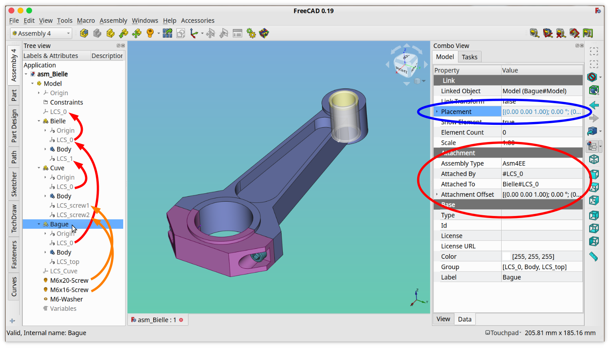
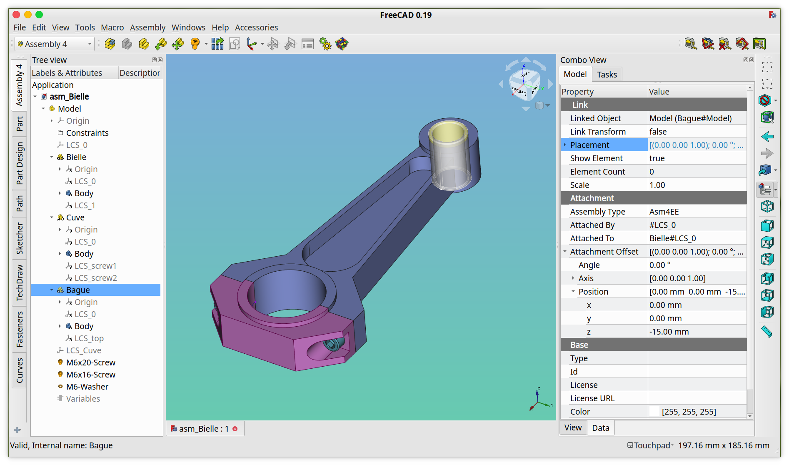

# FreeCAD Assembly 4 workbench technical manual

This manual presents the inner — *under-the-hood* — functioning of FreeCAD's Assembly4 workbench. It is primarily intended for power-users and developers.

## History

The project results from discussions on the FreeCAD forum [about an assembly without solver](https://forum.freecadweb.org/viewtopic.php?f=20&t=32843). It has then evolved into a dedicated workbench.

**Important Note:** Assembly 4 is **not** compatible with FreeCAD v0.18, and needs FreeCAD >= `v0.19.18353`

**Important Note:** Assembly 4 is **not** compatible with Assembly2+ and Assembly3.

## Principle

The very principle of Assembly4 is that FreeCAD container objects ( of type `App::Part` or `PartDesign::Body`) are linked together using the `App::Link` interface introduced in FreeCAD v0.19. The host parent assembly is also an `App::Part` type container objects called `Model`. The parts that are linked can be in the same document as the assembly or an external document, invariably. 

Even though an Assembly4 assembly is a standard FreeCAD `App::Part` type object, it has some particularities:

* it is called *Model* at creation time  
* it contains a group called *Constraints* at the root  
* it contains a Datum Coordinate System called *LCS_0* at the root
* it contains an `App::FeaturePython` object called *Variables* that can hold assembly-wide variables
* a FreeCAD document may contain only 1 Assembly4 *Model* (but can contain many `App::Part` obects)

Thus, a standard FreeCAD `App::Part` cannot serve as host container for an assembly. But since an Assembly4 *Model* is also an `App::Part` type object, it can itself be included into another higher-level Assembly4 *Model* to form nested assemblies with sub-assemblies and sub-sub-assemblies. There is no limit on the number of levels of such nested assemblies.

Also, since an `App::Part` container has an own reference coordinate system, each child `App::Link` instance of an `App::Part` is positioned in the parent assembly's reference coordinate system by its *Placement* property. This *Placement* property can be calculated in several ways:

* manually, by setting the parameters in the *Placement* property fields
* by the **Transform** tool, which allows to graphically move the `App::Link` instance
* by the built-in *ExpressionEngine*, that matches the positions of a coordinate system in the child `App::Part` and a coordinate system in the assembly
* by an external solver when this feature is implemented

## Data structure

We list here the code that creates various objects used in Assembly4. The purpose is to allow developers to extend the capabilities of these objects, and to create compatible objects. This can also be considered as the API of Assembly4.

### Assembly4 *Model*

### Assembly4 *Part*

### Assembly4 *Body*

### Assembly4 *Sketch*

### Assembly4 *Datum*

## Part placements

Linked parts are placed to each-other by matching their Datum Coordinate Systems (`PartDesign::CoordinateSystem`, called here-after LCS (Local Coordinate System)). There is no need for any geometry to be present to place and constrain parts relative to each other. LCS are used because they are both mechanical objects, since they fix all 6 degrees of freedom in an isostatic way, and mathematical objects that can be easily manipulated by rigorous methods (mainly combination and inversion).

To actually include some geometry, a body needs to be created, and designed using the PartDesign workbench. To be linked with the previously created model, this body needs to be inside the `App::Part container` called 'Model'.  

The result is the following:  

* the part _Bielle_ is placed in the assembly by attaching it's _LCS_0_ to the _LCS_0_ of the parent assembly. 
* the part _Cuve_ is placed in the assembly by placing its _LCS_0_ on the _LCS_1_ of the part _Bielle_
* the part _Bague_ is placed in the assembly by placing its _LCS_0_ on the _LCS_0_ of the part _Bielle_
* the parts _Screw_CHC_1_ and _Screw_CHC_2_ are placed in the assembly by placing their _LCS_0_ on the _LCS_1_ and _LCS_2_ of the part _Cuve_

## ExpressionEngine

Assembly4 uses a special and very useful feature of FreeCAD, the **ExpressionEngine**. Some parameters can be entered through mathematical formulae, that are evaluated by this ExpressionEngine. For Assembly4, it's the parameter _`Placement`_ of the inserted _`App::Link`_ object that is calculated, such that 2 LCS - one in the linked part and the one in the assembly - are superimposed. 

In normal use, the ExpressionEngine of an _`App::Link`_ object is hidden, it must be shown as in the following screenshot:

### Syntax

The syntax of the ExpressionEngine is the following:

**If the LCS belongs to the parent assembly:**

  `LCS_parent.Placement * constr_LinkName.AttachmentOffset * LinkedPart#LCS_link.Placement ^ -1`

**If the LCS belongs to a sister part:**

  `ParentLink.Placement * ParentPart#LCS_parent.Placement * constr_LinkName.AttachmentOffset * LinkedPart#LCS.Placement ^ -1`

* **ParentLink** is the name of the App::Link of the sister part in the assembly
* **ParentPart** is the name of the App::Part that the previous ParentLink refers-to
* **LCS_parent** is the LCS in the parent part (can be either the assembly itself or a sister part in the assembly)
* **constr_LinkName** is a FeaturePython object with a conventional name
* **LinkedPart** is the App::Part's name that the inserted App::Link refers-to
* **LCS_link** is the LCS in the linked part

### Constraints

To each part inserted into an assembly is associated an `App::FeaturePython` object, placed in the 'Constraints' group. This object contains information about the placement of the linked object in the assembly. It also contains an `App::Placement`, called '`AttachmentOffset`', which introduces an offset between the LCS in the part and the LCS in the assembly. The main purpose of this offset is to correct bad orientations between the 2 matching LCS. 

**Note:** These constraints are not really constraints in the traditional CAD sense, but since `App::FeaturePython` objects are very versatile, they could be expanded to contain real constraints in some (distant) future.

_Taking a closer look at the fields contained in an `App::FeaturePython` object associated with the part 'Bague'. The small button under the cursor opens the dialog that allows to edit the parameters of the Attachment Offset_

_Dialog that opens when clicking the previous small button, and permitting to edit the parameters of the_ `App::Placement` _called_ 'AttachmentOffset' _in the constraint associated with a link, and allowing relative placement of the link -vs- the attachment LCS_

## License

LGPLv2.1 (see [LICENSE](LICENSE))
